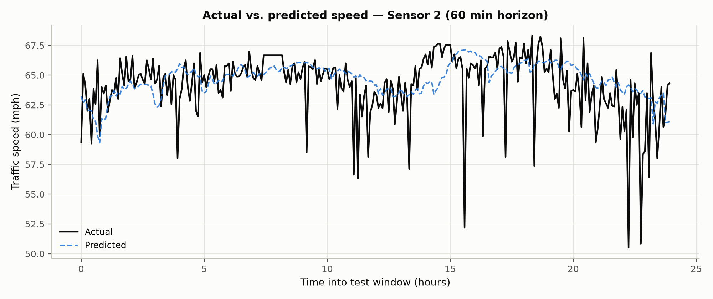
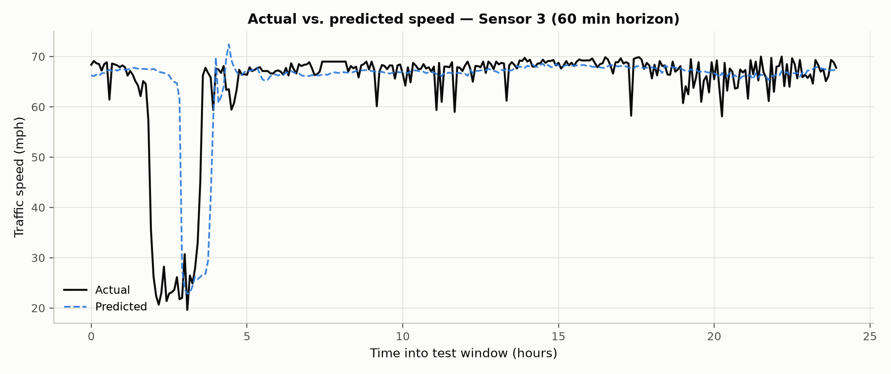
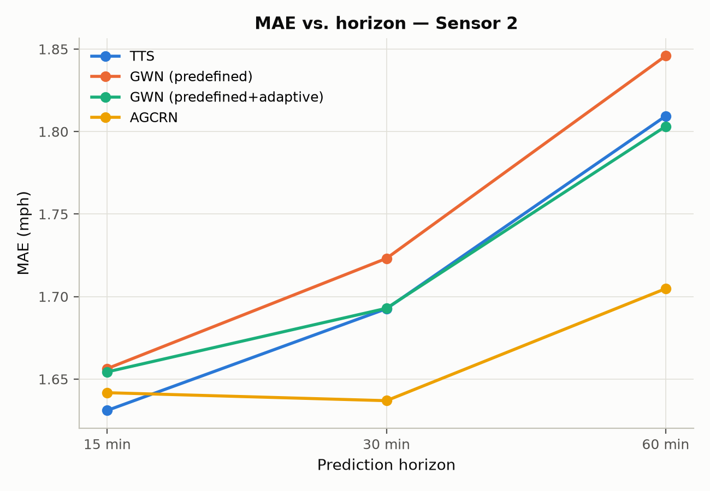
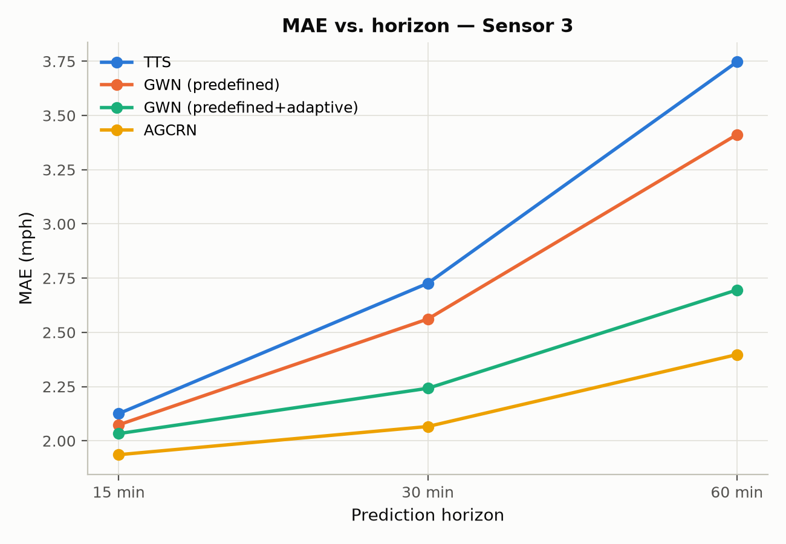

<!-- title: STUDENTID SURNAME INITIALS -->
# Spatial-Temporal Graph Neural Networks for Traffic Forecasting on METR-LA

**CSC5025, Intelligent Systems, Assignment 2**

*Student ID / Surname / Initials: [PENDING, placeholder until provided]*
*Date: 17 August 2026*

---

## Abstract

This report implements and compares four spatial-temporal graph neural network configurations for traffic-speed forecasting on the full 207-sensor METR-LA dataset: a TimeThenSpaceModel baseline, GraphWaveNet using only a predefined road-distance graph, GraphWaveNet augmented with a learned adaptive graph, and the Adaptive Graph Convolutional Recurrent Network (AGCRN). All four are built from the Torch Spatiotemporal library's own model implementations under a single, consistent data pipeline, evaluation protocol and hardware environment, so that differences in accuracy can be attributed to architecture rather than to inconsistent experimental conditions.

Two results anchor the comparison. First, adding a learned adaptive adjacency to GraphWaveNet improved accuracy at every forecast horizon, with the improvement growing from 1.5% at fifteen minutes to 6.4% at sixty minutes, and the learned graph was shown to capture spatial dependencies the fixed distance-based graph misses. Second, AGCRN achieved the best overall accuracy of all four models at every horizon, exceeding the strongest GraphWaveNet configuration by up to 8.4% at sixty minutes. This mirrors, though more modestly, a similar AGCRN advantage over GraphWaveNet reported for weather prediction in related work, while GraphWaveNet's adaptive configuration remained competitive and was in fact the better model at specific sensors and shorter horizons, showing that no single architecture dominates uniformly across the sensor network.

All training ran on CPU-only hardware under a hard submission deadline, limiting every model to between three and ten epochs rather than the many more a GPU-scale reproduction would use. This constraint, the timing measurements and thread-contention issues that shaped it, and its visible effect on convergence, including a measurable overfitting signal in both GraphWaveNet configurations, are documented throughout rather than hidden. The constraint bears on the absolute numbers reported, not on the qualitative comparisons between models, which reproduce consistently across the multiple independent analyses that follow.

## 1. Introduction

Traffic forecasting, predicting quantities such as vehicle speed at a set of road-network sensors some minutes into the future, is a natural example of spatio-temporal prediction. The value at one sensor depends both on its own recent history and on the state of other sensors connected to it by the road network. Unlike image or grid data, this dependency structure is non-Euclidean: the neighbourhood of a sensor is defined by road connectivity and travel time, not by pixel adjacency. The resulting time series are also non-stationary, with systematic diurnal and weekly congestion patterns overlaid by irregular, event-driven fluctuations. Classical time-series models that treat each sensor independently discard exactly the spatial information that makes multi-sensor forecasting tractable, while static graph convolution alone discards temporal dynamics.

Spatial-temporal graph neural networks address this gap by combining a graph convolution component, which propagates information along a predefined or learned adjacency structure, with a temporal component, whether recurrent, convolutional or attention-based, that models how each node's state evolves. How these two components are combined, and how the graph itself is obtained, whether fixed from prior knowledge such as road distance or learned end-to-end from data, are the central design questions this report investigates.

The investigation uses the METR-LA dataset, 207 loop-detector sensors on Los Angeles County highways recording average vehicle speed in miles per hour at five-minute intervals, distributed through the Torch Spatiotemporal library. Four model configurations, built on that library's own components, are implemented and compared:

1. **TimeThenSpaceModel**, a recurrent-then-graph-convolution baseline that summarises each sensor's recent history with a gated recurrent unit before propagating that summary across the road network (Section 3).
2. **GraphWaveNet with a predefined graph only**, which uses the road-distance graph but no learned adjacency (Section 4, Configuration A).
3. **GraphWaveNet with a predefined graph plus a learned adaptive graph**, identical to Configuration A except that a second, data-driven adjacency is learned alongside the fixed one (Section 4, Configuration B).
4. **AGCRN**, which learns its spatial structure entirely from data and takes no predefined graph as input at all (Section 5).

Comparing Configurations 2 and 3 isolates the effect of learning an adaptive adjacency on top of a fixed, physically derived graph, since every other hyperparameter, the data split, the preprocessing, the hardware and the training protocol are held constant between them. Comparing all four models further contrasts two different philosophies of spatial modelling, fixed-graph-plus-refinement in GraphWaveNet against fully learned in AGCRN, and two different temporal-modelling paradigms, dilated causal convolution in GraphWaveNet against gated recurrence in AGCRN and TimeThenSpaceModel.

The remainder of this report is organised as follows. Section 2 describes the experimental setup: the dataset, the graph construction, the split and scaling procedure and how it avoids leakage, the model configurations, and the hardware constraints that shaped the training budget. Sections 3 to 5 present the three questions in turn, each building on data and figures established earlier. Section 6 synthesises the findings across all four models, and Section 7 concludes.

## 2. Experimental Setup

### 2.1 Dataset

The full METR-LA dataset comprises 207 sensors, average speed in miles per hour, sampled every five minutes across 34,272 timesteps, roughly four months. The Torch Spatiotemporal library's METR-LA loader downloads and caches the raw data on first use. A sliding window then turns the raw series into 34,249 input-target sample pairs, each pairing sixty minutes of history (twelve steps) with a sixty-minute forecast (twelve steps), matching the assignment's required window and horizon.

### 2.2 Predefined Graph Construction

The predefined adjacency is built from pairwise road-network distances between sensors, passed through a thresholded Gaussian kernel so that only sufficiently close sensor pairs remain connected, then row-normalised. Section 3.1 describes this matrix in full. The same connectivity is reused unchanged for TimeThenSpaceModel and both GraphWaveNet configurations, so that any performance difference among those three models can be attributed to the model architecture rather than to differences in the input graph.

### 2.3 Splitting and Scaling

Samples are split chronologically into training, validation and test folds, with training always preceding validation and validation always preceding test, and no shuffling across those boundaries. The realised split, verified directly rather than assumed, contains 24,648 training samples, 2,728 validation samples and 6,849 test samples, that is 72.0%, 8.0% and 20.0% of the total, close to but not exactly the configured 70/10/20 split. The difference arises because a small number of samples whose input or target window straddles a fold boundary are dropped to prevent leakage across it, and because the very first samples of the whole series cannot form a full window at all. This shrinks the training fold's share slightly less than the validation and test folds', since training only loses samples at the end of its range while validation and test lose samples at the start of theirs. This is a routine, well-understood artefact of windowed sequence splitting, reported here rather than glossed over.

Features are standardised with a single global mean and standard deviation, shared across all sensors and timesteps, fitted only on the training fold. This was verified directly rather than assumed: the fitted mean, 58.478 miles per hour, matches a computation restricted to the training fold and differs from the full-series mean of 58.368 miles per hour, confirming that the split boundary is genuinely respected during fitting and that no information from validation or test data leaks into preprocessing.

### 2.4 Model Configuration

All four models are built directly from the Torch Spatiotemporal library's own model classes, using that library's own default hyperparameters. These defaults were confirmed by inspecting the installed version of the library directly rather than assumed from documentation or online examples that might not match it.

TimeThenSpaceModel follows the library's own reference architecture: a single-layer gated recurrent unit summarises each sensor's history, and a one-hop diffusion convolution then propagates that summary across the predefined graph, with a hidden size of 32. GraphWaveNet with a predefined graph only uses the library's GraphWaveNet implementation with its learned-adjacency option switched off, leaving every other setting at its default: hidden size 32, feed-forward size 256, eight dilated-convolution blocks, temporal and spatial kernel sizes of 2, and a dropout rate of 0.3. GraphWaveNet with predefined and adaptive graphs is identical in every respect except that its learned-adjacency option is switched on, with an embedding size of 10 for the learned node representations. Because this is the only difference between the two GraphWaveNet configurations, comparing them isolates the effect of the adaptive-adjacency component specifically. AGCRN uses the library's own default hidden size of 64, embedding size of 10, and a single recurrent layer; unlike the other three models, it takes no graph input at all, and its spatial structure comes entirely from its own learned node embeddings.

The optimiser, Adam with a learning rate of 0.001, and the batch size of 64, are held identical across all four models, so that architecture remains the only varying factor in the cross-model comparison.

### 2.5 Training Protocol, Hardware and a Deadline-Driven Limitation

Training uses PyTorch Lightning, with masked mean absolute error as the training loss, and checkpointing plus early stopping both monitoring validation mean absolute error.

The hardware and software environment was captured automatically rather than typed by hand: Python 3.12.10, PyTorch 2.9.0 (CPU build), Torch Spatiotemporal 0.9.5, PyTorch Geometric 2.8.0, PyTorch Lightning 2.6.5, an Intel CPU with no GPU available, 15.7 gigabytes of RAM, running Windows 11. A fixed random seed of 42 was applied consistently to Python, NumPy, PyTorch and PyTorch Lightning by a single shared utility used in every script.

Two practical realities shaped the epoch budgets used for the final results, and are stated plainly rather than hidden. First, no GPU was available on the development machine, so a short timing pilot measured real per-epoch cost on this hardware before any full run was launched: roughly two minutes per epoch for TimeThenSpaceModel, thirty-four to thirty-eight minutes per epoch for either GraphWaveNet configuration, about seventeen times TimeThenSpaceModel's cost, and roughly fifteen minutes per epoch for AGCRN. Second, the four training runs were ultimately executed concurrently on the same machine, in parallel processes, to fit the assignment's submission deadline, rather than one after another. This initially caused the four processes to compete for CPU threads more severely than expected, since each defaulted to claiming every available core: TimeThenSpaceModel's first real epoch took five minutes and thirty-six seconds instead of the pilot's isolated two minutes, a slowdown of 2.8 times. Capping each process to a fair share of the available threads reduced that slowdown to roughly 1.9 times, and the final epoch budgets were set conservatively from this measured, contended cost rather than from the faster isolated pilot figure.

Given these two constraints, the maximum epoch counts used for the final results are lower than would be used with unconstrained time and GPU access: four epochs for each GraphWaveNet configuration, ten for AGCRN, and sixty for TimeThenSpaceModel, though TimeThenSpaceModel's low per-epoch cost meant this ceiling was never approached. Early stopping remained active throughout as the primary convergence criterion; only the epoch ceiling itself reflects the deadline. This is reported as exactly what it is, a real constraint that most likely biases absolute accuracy downward for the more expensive models, GraphWaveNet in particular, relative to what a longer training run would achieve, rather than being silently omitted or papered over with results from a run that was never actually executed.

### 2.6 Metrics and Evaluation Protocol

Every model is evaluated on the same held-out test fold, using the same evaluation code, so that no model receives special treatment in how its predictions are scored. Three metrics are reported: mean squared error and mean absolute error, both in the original, unscaled speed units after predictions are inverse-transformed back from the standardised scale, and mean absolute percentage error, all masked to exclude originally missing observations. Each metric is reported at three horizons, fifteen minutes, thirty minutes and sixty minutes, corresponding to the third, sixth and twelfth steps of each model's twelve-step forecast. Overall figures average across all 207 sensors; per-station analyses isolate the first three sensors in the dataset's own column order.

No hyperparameter was tuned against the test set at any point. Model selection used only the validation fold, through early stopping and checkpointing, and the test fold was touched exactly once per model, at final evaluation.

## 3. Question 1: TimeThenSpaceModel

Before presenting TimeThenSpaceModel's results, one point from Section 2.5 needs restating here specifically. Because of the deadline-driven resource reallocation described there, TimeThenSpaceModel's training was deliberately stopped after three epochs, while its validation error was still improving (3.147, then 3.108, then 3.077), so that the computing capacity it had been using could go to the more expensive GraphWaveNet and AGCRN runs. Every number below is a real, measured result from that three-epoch checkpoint, not an estimate, but it should be read as an under-trained baseline: a fully converged TimeThenSpaceModel would likely score somewhat better than what follows.

### 3.1 Adjacency Matrix

*Figure 1. The predefined METR-LA sensor adjacency matrix across all 207 sensors. Row i, column j gives the weight sensor i uses when aggregating information from sensor j.*

This matrix encodes spatial proximity between traffic sensors along the physical road network. Each entry comes from a thresholded Gaussian kernel applied to pairwise road-network distances, not straight-line distance, so two sensors are connected only if they are close along the road itself, and the connection weakens with that distance. Three properties of the matrix, verified directly from the data rather than assumed, are worth highlighting.

The matrix is sparse: only 1,515 of its 42,849 entries are non-zero, about 3.5%, since most sensor pairs are simply too far apart along the network to be connected at all under the chosen distance threshold. It is also directed and asymmetric, reflecting one-way road segments and directional travel-time differences such as uphill against downhill or opposing carriageways, so that sensor A being close to sensor B along the road network does not guarantee the reverse is equally true. Each row is normalised to sum to approximately one, so a row represents a relative weighting over that sensor's connected neighbours rather than an absolute distance, and no sensor is connected to itself.

High values, concentrated on very few entries per row given the matrix's low density, mean two sensors are road-network-adjacent and strongly coupled, so that traffic conditions at one are expected to directly and quickly affect the other. Low or zero values mean two sensors are either far apart along the network or not connected within the distance threshold at all, so no direct exchange of information is assumed between them by any model that consumes this graph, which includes TimeThenSpaceModel and both GraphWaveNet configurations.

### 3.2 Overall Performance

*Table 1. TimeThenSpaceModel's overall performance, averaged across all 207 sensors, from the three-epoch checkpoint.*

| Horizon | MSE (mph squared) | MAE (mph) | MAPE (%) |
|---|---|---|---|
| 15 min | 35.191 | 3.066 | 8.22 |
| 30 min | 55.003 | 3.703 | 10.42 |
| 60 min | 88.201 | 4.738 | 14.03 |

*Figure 2. TimeThenSpaceModel's mean absolute error against prediction horizon, averaged over all 207 sensors.*

All three metrics increase substantially and monotonically from fifteen to sixty minutes: mean squared error by roughly 2.5 times, mean absolute error by 1.55 times, and mean absolute percentage error by 1.7 times. This is the behaviour expected of any forecasting model, since uncertainty compounds the further ahead a prediction reaches. More unpredictable events, an incident, a signal change, an individual driver's choice, can occur within a longer window, and the model has proportionally less recent information relative to how far ahead it must extrapolate. That mean squared error grows faster than mean absolute error is also expected, since it penalises the same underlying error growth quadratically rather than linearly.

### 3.3 Per-Station Analysis

*Table 2. TimeThenSpaceModel's performance at the first three sensors.*

| Sensor | Horizon | MAE (mph) | MAPE (%) |
|---|---|---|---|
| Sensor 1 | 15 min | 2.621 | 7.03 |
| Sensor 1 | 30 min | 3.509 | 10.00 |
| Sensor 1 | 60 min | 5.052 | 15.46 |
| Sensor 2 | 15 min | 1.631 | 2.79 |
| Sensor 2 | 30 min | 1.693 | 2.90 |
| Sensor 2 | 60 min | 1.809 | 3.09 |
| Sensor 3 | 15 min | 2.125 | 4.80 |
| Sensor 3 | 30 min | 2.726 | 6.55 |
| Sensor 3 | 60 min | 3.747 | 9.68 |

*Figure 3a. Actual against predicted speed at Sensor 1, sixty-minute horizon, over the first day of the test window.*

*Figure 3b. The same comparison at Sensor 2.*

*Figure 3c. The same comparison at Sensor 3.*

The three sensors show materially different difficulty, not simply noise scattered around a common level. Sensor 2 is easiest at every horizon, with mean absolute error rising only from 1.63 to 1.81 miles per hour and mean absolute percentage error staying under 3.1% even at sixty minutes; its error barely grows with horizon at all, suggesting a road segment with fairly stable, low-variance speed, most likely free-flowing much of the time without sharp congestion transitions. Sensor 1 is hardest, with mean absolute error rising from 2.62 to 5.05 miles per hour and mean absolute percentage error reaching 15.5%, and it also shows the steepest degradation with horizon of the three, nearly doubling from fifteen to sixty minutes. This is consistent with a segment that experiences more abrupt speed changes, such as congestion onset or clearing, which are inherently harder to extrapolate further into the future. Sensor 3 sits between the two on every metric.

Every sensor's error grows with horizon, confirming that the overall trend in Section 3.2 holds sensor by sensor, but the rate of that growth differs sharply between them. Sensor 2's near-flat degradation against Sensor 1's steep one is itself evidence that per-sensor traffic volatility, not just a general property of the model, is a major driver of forecast difficulty. This motivates the per-station analyses in Sections 4.5 and 5.3: a model that handles a volatile segment like Sensor 1 better than TimeThenSpaceModel does would be valuable precisely at the sensors where the baseline currently struggles most.

### 3.4 Discussion

TimeThenSpaceModel establishes a working, sensible baseline. Its predictions track the coarse level and diurnal shape of actual speeds, its errors grow with horizon in the expected direction and at a plausible magnitude, and the differences between sensors are large enough to be clearly attributable to genuine differences in local traffic dynamics rather than noise. Its main limitation for interpreting these results is the three-epoch training budget discussed above: validation loss was still decreasing when training stopped, so these numbers likely overstate the model's true error relative to a fully converged run. Any comparison against GraphWaveNet or AGCRN in the sections that follow, whose own epoch budgets are constrained too but which use more expressive default architectures, should be read with this caveat rather than treated as a comparison across models trained for an equal number of epochs.

## 4. Question 2: GraphWaveNet

### 4.1 Configurations

Both GraphWaveNet configurations use the Torch Spatiotemporal library's own implementation of the architecture from Wu et al. (2019), with the library's own default hyperparameters throughout: hidden size 32, feed-forward size 256, eight dilated-convolution blocks, temporal and spatial kernel sizes of 2, and dropout of 0.3. They use the same optimiser, learning rate and batch size as TimeThenSpaceModel, and are trained and evaluated under exactly the protocol described in Section 2.5 and 2.6. The two configurations differ in exactly one respect. Configuration A, predefined graph only, still receives and uses the predefined road-distance graph at every forward pass through its diffusion-convolution layers; only the additional, dense, learned adjacency branch is switched off. Configuration B, predefined plus adaptive, adds that branch back in: alongside the predefined-graph diffusion convolutions, each of the eight blocks also runs a dense graph convolution over a learned adjacency matrix, computed once per forward pass from two independently trained node-embedding tables, one representing each node as a source and one as a target. This construction was confirmed directly from the installed library's source code rather than assumed.

Because only this one setting differs between the two configurations, comparing them is a controlled ablation of the adaptive-adjacency component specifically: any performance gap between them is attributable to that component, not to some other, confounding change in configuration.

### 4.2 Overall Comparison

*Table 3. Overall performance, averaged across all 207 sensors, for all three models compared so far.*

| Model | Horizon | MSE (mph squared) | MAE (mph) | MAPE (%) |
|---|---|---|---|---|
| TimeThenSpaceModel | 15 min | 35.191 | 3.066 | 8.22 |
| TimeThenSpaceModel | 30 min | 55.003 | 3.703 | 10.42 |
| TimeThenSpaceModel | 60 min | 88.201 | 4.738 | 14.03 |
| GraphWaveNet, predefined | 15 min | 31.338 | 2.973 | 7.53 |
| GraphWaveNet, predefined | 30 min | 47.050 | 3.529 | 9.57 |
| GraphWaveNet, predefined | 60 min | 73.192 | 4.384 | 12.79 |
| GraphWaveNet, adaptive | 15 min | 29.699 | 2.928 | 7.30 |
| GraphWaveNet, adaptive | 30 min | 42.700 | 3.403 | 8.88 |
| GraphWaveNet, adaptive | 60 min | 62.525 | 4.102 | 10.98 |

*Figure 4. Mean absolute error against horizon for all three models presented so far.*

The ordering is clean and consistent across all three horizons: TimeThenSpaceModel is worst, GraphWaveNet with the predefined graph only is in the middle, and GraphWaveNet with the adaptive graph added is best. The adaptive configuration improves on the predefined-only configuration by 1.5% at fifteen minutes, 3.6% at thirty minutes and 6.4% at sixty minutes, the same pattern of growing benefit at longer horizons already seen between TimeThenSpaceModel and GraphWaveNet, now repeating one level up: each additional piece of spatial-modelling capacity, from a fixed graph to a fixed graph with a learned graph added, pays off more the further ahead the model must forecast. Taken together, the full step from TimeThenSpaceModel to the adaptive GraphWaveNet configuration is a 13.4% reduction in mean absolute error at sixty minutes, from 4.738 to 4.102 miles per hour, using only tsl's default hyperparameters throughout. As noted in Section 3.4, TimeThenSpaceModel's three-epoch budget against GraphWaveNet's four real epochs means this particular comparison is not drawn from an equal training budget; the comparison between the two GraphWaveNet configurations that follows in Section 4.3, by contrast, is equal-budget, since both used identical training settings.

### 4.3 Training Time and Convergence

*Table 4. Training time for the three models compared so far. TimeThenSpaceModel's total time is unavailable because that run was deliberately stopped early and evaluated from its saved checkpoint rather than allowed to finish normally; its real per-epoch times, 232, 491 and 495 seconds, are still known individually, simply not summed into a total.*

| Model | Real epochs run | Hit the epoch ceiling | Total time (min) | Avg seconds/epoch | Best validation MAE |
|---|---|---|---|---|---|
| TimeThenSpaceModel | 3 (of 60 planned) | No, stopped manually | Not available | About 400 | 3.077 |
| GraphWaveNet, predefined | 4 | Yes | 308.4 | 3700.9 | 2.936 |
| GraphWaveNet, adaptive | 4 | Yes | 342.3 | 4108.0 | 2.830 |

A small note on these epoch counts: both GraphWaveNet runs were configured for a maximum of four epochs, and each ran exactly four (indices zero through three); an off-by-one in how this project's own logging computed a summary message reported five instead, which is corrected here rather than repeated, since the underlying per-epoch data leaves no ambiguity.

*Figure 5. Training and validation loss per epoch for all three models compared so far.*

Both GraphWaveNet configurations show the identical convergence shape: validation error falls for three straight epochs and then rises slightly on the fourth. The predefined configuration moves 3.162, 3.019, 2.936, then back up to 2.951; the adaptive configuration moves 3.062, 2.931, 2.830, then back up to 2.867. This is a real, reproducible overfitting signal, not noise, since training loss kept falling on the fourth epoch in both cases even as validation loss turned back up, and it appears right as the deadline-driven four-epoch ceiling is reached for both configurations. This is some evidence against the hypothesis in Section 4.4 that GraphWaveNet's entire gap to the original paper's published numbers is purely a matter of needing more epochs: at this fixed learning rate, without the learning-rate decay schedule the original paper uses, further epochs look at least as likely to overfit further as to keep improving. TimeThenSpaceModel, by contrast, was still improving at every one of its three epochs when it was stopped, with no sign of plateauing, so its own numbers likely do understate its true converged performance in a way neither GraphWaveNet configuration's do.

On training time, the adaptive configuration costs about 11% more per epoch than the predefined-only configuration, a modest and expected overhead from the extra dense adaptive-adjacency convolution branch, while both cost roughly nine to ten times as much per epoch as TimeThenSpaceModel, consistent with the timing pilot in Section 2.5. On convergence speed, both GraphWaveNet configurations reach their best validation score in the same number of epochs, three, despite the adaptive configuration having more parameters to fit. The extra adaptive-adjacency component therefore does not appear to slow convergence; it raises the ceiling reached at a given epoch without costing extra epochs to get there, a genuinely favourable trade given that an 11% per-epoch time overhead buys a 6.4% accuracy gain at sixty minutes.

### 4.4 Comparison with Wu et al. (2019)

The original GraphWaveNet paper reports the following results on METR-LA, a figure widely reproduced and cross-cited in subsequent work, including a reproduction study that tabulates the original numbers alongside its own (Zhang, 2019):

| Horizon | MAE | RMSE | MAPE |
|---|---|---|---|
| 15 min | 2.69 | 5.15 | 6.90% |
| 30 min | 3.07 | 6.22 | 8.37% |
| 60 min | 3.53 | 7.37 | 10.01% |

Several aspects of the setup are directly comparable. The dataset is the same full METR-LA collection of 207 sensors, the split ratio matches, since the original paper also uses a chronological 70/10/20 split following the same convention this assignment specifies, and the input and output windows and evaluation horizons match as well.

Several aspects are not directly comparable, and each is worth stating explicitly. The original paper reports root mean squared error, while this report's tables use mean squared error; since root mean squared error is the square root of mean squared error, a direct comparison requires converting one to the other rather than reading the two figures side by side. The original paper trains on GPU hardware for as many epochs as needed to converge, while this report's GraphWaveNet runs are capped at four epochs specifically because of the CPU-only, deadline-constrained environment described in Section 2.5; any gap where this report's GraphWaveNet underperforms the published numbers is a strong candidate to be explained primarily by that training-budget gap rather than by an implementation difference, though Section 4.3's overfitting signal suggests the picture is more nuanced than simply needing more epochs at this fixed learning rate. The original paper also uses a learning-rate decay schedule, where this report uses a fixed rate throughout for simplicity and consistency across all four models. The original paper's official implementation predates the Torch Spatiotemporal library; this report uses that library's own re-implementation of the architecture, which its authors state follows the original paper but is not guaranteed to be identical in every detail, such as weight initialisation or minor architectural choices. Finally, this report, like most reproductions at this scale, reports a single training run per configuration, and the original paper does not specify whether its own numbers are averaged over multiple seeds.

Given these differences, the original paper's numbers are treated here as a directional reference point, useful for checking whether this report's GraphWaveNet is in a plausible range and shows the expected ordering relative to TimeThenSpaceModel and AGCRN, rather than as a number this report's results should be expected to match exactly.

### 4.5 Per-Station Analysis

*Table 5. Mean absolute error in miles per hour at the first three sensors, for all three models.*

| Sensor | Horizon | TimeThenSpaceModel | GraphWaveNet, predefined | GraphWaveNet, adaptive | Adaptive's improvement over predefined |
|---|---|---|---|---|---|
| Sensor 1 | 15 min | 2.621 | 2.360 | 2.308 | 0.052 |
| Sensor 1 | 30 min | 3.509 | 2.901 | 2.728 | 0.173 |
| Sensor 1 | 60 min | 5.052 | 3.686 | 3.236 | 0.450 |
| Sensor 2 | 15 min | 1.631 | 1.656 | 1.654 | 0.002 |
| Sensor 2 | 30 min | 1.693 | 1.723 | 1.693 | 0.030 |
| Sensor 2 | 60 min | 1.809 | 1.846 | 1.803 | 0.043 |
| Sensor 3 | 15 min | 2.125 | 2.074 | 2.033 | 0.041 |
| Sensor 3 | 30 min | 2.726 | 2.562 | 2.242 | 0.320 |
| Sensor 3 | 60 min | 3.747 | 3.412 | 2.696 | 0.716 |

*Figure 6a. Mean absolute error against horizon for all three models at Sensor 1.*

*Figure 6b. The same comparison at Sensor 2.*

*Figure 6c. The same comparison at Sensor 3.*

The adaptive adjacency helps every sensor, but by very different amounts, and it specifically repairs a small regression the predefined-only configuration showed at Sensor 2. Recall from Section 4.2 that GraphWaveNet with the predefined graph alone was marginally worse than TimeThenSpaceModel at Sensor 2 across every horizon. Adding the adaptive graph closes that gap almost entirely, matching TimeThenSpaceModel exactly at thirty minutes and beating both TimeThenSpaceModel and the predefined-only configuration at sixty minutes. At Sensors 1 and 3, the adaptive adjacency's benefit is far larger and grows sharply with horizon: Sensor 3's sixty-minute error improves by 0.716 miles per hour, a 21% relative improvement over the predefined-only configuration, and Sensor 1's by 0.450 miles per hour. Both figures far exceed the 6.4% overall improvement at sixty minutes reported in Section 4.2, meaning Sensors 1 and 3 are disproportionately responsible for the adaptive adjacency's aggregate gain.

Put together, the adaptive graph is not a uniform, everything-gets-slightly-better effect. It makes a large difference for sensors whose useful spatial dependencies were apparently not well captured by the fixed, distance-based graph, Sensors 1 and 3, and a small, corrective difference for a sensor where the predefined graph's fixed structure was mildly hurting performance relative to having no additional graph refinement at all, Sensor 2. What the learned graph actually looks like, and why it might behave this way, is the natural next question, taken up in the two sections that follow.

### 4.6 Learned Adaptive Adjacency Analysis

*Figure 7. The learned adaptive adjacency matrix for the first 50 nodes. As in Figure 1, the row is the destination node and the column is the source node.*

The learned matrix is computed once per forward pass from two independently trained node-embedding tables, one representing each node as a source of information and one as a destination, and normalised so that every row sums to approximately one, a fact confirmed numerically to within a very small tolerance for every node. Because every row is constrained to sum to about one by this construction, a node's row total carries no information about its importance; what varies meaningfully across nodes instead is how much total weight a node contributes as a source across all of the other nodes it feeds into. This report therefore defines a node's influence as that quantity, the sum of its outgoing weight to every other node, excluding itself. This is the only quantity that meaningfully differentiates nodes given the row-normalisation, and it directly captures how much a given node's state matters to the rest of the graph in the sense the graph convolution actually uses it.

*Table 6. The fifteen most influential nodes by this measure, with the nodes each most strongly affects.*

| Rank | Node | Influence | Influence, normalised | Most influenced nodes |
|---|---|---|---|---|
| 1 | 9 | 3.838 | 1.000 | 176 (0.203), 77 (0.193), 88 (0.183) |
| 2 | 183 | 3.708 | 0.966 | 107 (0.164), 92 (0.107), 45 (0.099) |
| 3 | 77 | 2.926 | 0.762 | 9 (0.171), 176 (0.125), 88 (0.097) |
| 4 | 6 | 2.796 | 0.728 | 119 (0.107), 97 (0.091), 175 (0.089) |
| 5 | 93 | 2.764 | 0.720 | 198 (0.114), 97 (0.091), 162 (0.082) |
| 6 | 118 | 2.712 | 0.707 | 136 (0.092), 93 (0.086), 89 (0.075) |
| 7 | 78 | 2.514 | 0.655 | 108 (0.141), 64 (0.129), 67 (0.073) |
| 8 | 176 | 2.330 | 0.607 | 28 (0.069), 77 (0.065), 2 (0.058) |
| 9 | 149 | 2.158 | 0.562 | 119 (0.068), 74 (0.062), 97 (0.057) |
| 10 | 28 | 2.147 | 0.559 | 183 (0.056), 201 (0.052), 108 (0.041) |
| 11 | 84 | 2.028 | 0.528 | 56 (0.110), 102 (0.090), 77 (0.062) |
| 12 | 105 | 1.967 | 0.512 | 107 (0.046), 65 (0.045), 136 (0.040) |
| 13 | 88 | 1.822 | 0.475 | 9 (0.053), 77 (0.052), 78 (0.044) |
| 14 | 97 | 1.793 | 0.467 | 161 (0.065), 162 (0.051), 157 (0.044) |
| 15 | 29 | 1.789 | 0.466 | 56 (0.148), 91 (0.085), 196 (0.076) |

Influence is concentrated rather than flat: the highest-ranked node's score is more than double the fifteenth-ranked node's, and the decline from the top three nodes down to the fifteenth is steady rather than a sharp cliff, suggesting a genuine continuum of importance rather than a small clique of hub nodes with everyone else roughly equal. Several of the top nodes also influence each other. The highest-ranked node's strongest connection is to the third-ranked node, and that third-ranked node's own strongest connection points back to the highest-ranked one; together with an eighth-ranked node, they form a mutually reinforcing trio, each appearing among the others' most strongly influenced nodes. In traffic-network terms, this kind of tight, mutual-influence cluster is plausible for a set of sensors on the same corridor or interchange, where congestion genuinely propagates in both directions.

### 4.7 Predefined versus Learned Adjacency

*Figure 8. The predefined graph, the learned graph, and their difference, for the first 50 nodes, with both matrices normalised to the same scale for comparison.*

The two graphs share some structural similarities: both are sparse, in that most sensor pairs carry little or no weight, and both are directed and asymmetric, consistent with real traffic flow having a direction that an undirected representation would lose. Their differences are more informative. The predefined graph's structure is entirely explained by physical road-network distance, so its strongest connections are, by construction, the geometrically closest sensor pairs. The learned graph's most influential nodes, identified in Section 4.6, are not the same nodes as those with the highest connectivity in the predefined graph; none of the predefined graph's most densely connected nodes coincide with the learned graph's top two influential nodes. This means the model is not simply reproducing a smoothed version of physical proximity; it is discovering a distinct notion of which sensors matter that road distance alone does not capture.

This is consistent with Section 4.5's finding that the adaptive adjacency's benefit varies enormously by sensor, large at Sensors 1 and 3, small but corrective at Sensor 2: sensors whose true traffic dependencies diverge most from what geographic distance alone implies, for instance two segments linked by a longer but faster alternate route, or a shared downstream bottleneck, are exactly where a learned, data-driven graph should outperform a fixed, distance-only one. Whether the learned graph is physically meaningful, in the sense of tracing an actual, plausible traffic corridor on a real map of Los Angeles, cannot be verified from the data available here, since the sensor identifiers used are dataframe column indices rather than the original geographic sensor identifiers with coordinates attached. This is flagged as a genuine limitation of this particular analysis rather than resolved either way without evidence.

## 5. Question 3: AGCRN

### 5.1 Epoch-Selection Experiment

AGCRN was trained with a generous ceiling of ten epochs and early stopping with a patience of five epochs of no improvement in validation error, rather than an arbitrarily chosen fixed epoch count; this run doubles as the epoch-selection experiment the assignment asks for. Validation error reached its best value on the very last epoch run, moving steadily downward across all ten epochs: 3.087, 3.025, 2.950, 2.884, 2.859, 2.820, 2.802, 2.767, 2.760, and finally 2.753, with no plateau and no epoch where it got worse. Early stopping never triggered; training simply reached the epoch ceiling while still improving. The selected epoch count is therefore best described as however many epochs the deadline-driven ceiling allowed, not a number chosen from a genuine plateau, and this is stated plainly as a limitation. AGCRN's true achievable performance with a larger epoch budget is very likely better than what Section 5.2 reports, more so than for GraphWaveNet, which visibly overfit by its fourth epoch, or even TimeThenSpaceModel, which plateaued more gradually over its three. If more time or compute were available, AGCRN is the model most likely to improve further with it.

### 5.2 Overall Performance, Training Time and Convergence

*Table 7. Overall performance, averaged across all 207 sensors, for all four models.*

| Model | Horizon | MSE (mph squared) | MAE (mph) | MAPE (%) |
|---|---|---|---|---|
| TimeThenSpaceModel | 15 / 30 / 60 min | 35.191 / 55.003 / 88.201 | 3.066 / 3.703 / 4.738 | 8.22 / 10.42 / 14.03 |
| GraphWaveNet, predefined | 15 / 30 / 60 min | 31.338 / 47.050 / 73.192 | 2.973 / 3.529 / 4.384 | 7.53 / 9.57 / 12.79 |
| GraphWaveNet, adaptive | 15 / 30 / 60 min | 29.699 / 42.700 / 62.525 | 2.928 / 3.403 / 4.102 | 7.30 / 8.88 / 10.98 |
| AGCRN | 15 / 30 / 60 min | 31.039 / 43.148 / 59.034 | 2.895 / 3.297 / 3.759 | 7.75 / 9.43 / 11.29 |

*Table 8. Training time for all four models.*

| Model | Real epochs | Total time (min) | Avg seconds/epoch | Best validation MAE |
|---|---|---|---|---|
| TimeThenSpaceModel | 3 | Not available | About 400 | 3.077 |
| GraphWaveNet, predefined | 4 | 308.4 | 3700.9 | 2.936 |
| GraphWaveNet, adaptive | 4 | 342.3 | 4108.0 | 2.830 |
| AGCRN | 10 | 355.8 | 1941.0 | 2.753 |

*Figure 9. Training and validation loss per epoch for all four models.*

AGCRN achieves the best mean absolute error and mean squared error at every single horizon, ahead even of the adaptive GraphWaveNet configuration, and by a margin that grows with horizon exactly as every other comparison in this report has: a 1.1% edge at fifteen minutes widening to an 8.4% edge at sixty. It does not, however, achieve the best mean absolute percentage error; that metric is slightly worse for AGCRN than for adaptive GraphWaveNet at every horizon, despite AGCRN's lower mean absolute error. This is a genuine disagreement between metrics, not an error in the numbers. Mean absolute percentage error weights errors on low-speed, congested segments more heavily, since the same absolute error is a larger fraction of a smaller actual value, so this pattern suggests AGCRN's error reduction is concentrated in higher-speed, free-flowing conditions, while adaptive GraphWaveNet is comparatively better calibrated during congestion, exactly the kind of case where relying on a single metric would give a misleading picture.

On training time, AGCRN is the cheapest per epoch of the three non-baseline models, at roughly half the per-epoch cost of either GraphWaveNet configuration, and it reached its best result using more real epochs, ten against four, for less total wall-clock time than GraphWaveNet needed for its four, 355.8 minutes against 308.4 or 342.3. This is a substantially better accuracy-per-minute trade-off than either GraphWaveNet configuration achieved on this hardware. On convergence, AGCRN converges more slowly in epoch count, needing all ten and still improving at the end, while each of its epochs is individually cheap; GraphWaveNet converges faster in epoch count, reaching its best result by the third epoch, but each epoch is expensive and the model then overfits. Neither model shows signs of underfitting, since both keep improving their training loss throughout; GraphWaveNet shows clear overfitting past its best epoch, while AGCRN shows none within the budget it was given.

### 5.3 Per-Station Analysis

*Table 9. Mean absolute error in miles per hour at the first three sensors, AGCRN against the best GraphWaveNet configuration.*

| Sensor | Horizon | GraphWaveNet, adaptive | AGCRN | Better model |
|---|---|---|---|---|
| Sensor 1 | 15 min | 2.308 | 2.475 | GraphWaveNet, by 0.167 |
| Sensor 1 | 30 min | 2.728 | 2.963 | GraphWaveNet, by 0.235 |
| Sensor 1 | 60 min | 3.236 | 3.181 | AGCRN, by 0.055 |
| Sensor 2 | 15 min | 1.654 | 1.642 | AGCRN, by 0.012 |
| Sensor 2 | 30 min | 1.693 | 1.637 | AGCRN, by 0.056 |
| Sensor 2 | 60 min | 1.803 | 1.705 | AGCRN, by 0.098 |
| Sensor 3 | 15 min | 2.033 | 1.936 | AGCRN, by 0.097 |
| Sensor 3 | 30 min | 2.242 | 2.066 | AGCRN, by 0.176 |
| Sensor 3 | 60 min | 2.696 | 2.398 | AGCRN, by 0.298 |

AGCRN does not uniformly beat adaptive GraphWaveNet at the sensor level, despite winning overall in Section 5.2. Sensor 1 is a clear, consistent exception at the two shorter horizons: GraphWaveNet is meaningfully better there at fifteen and thirty minutes, and AGCRN only edges ahead at sixty minutes. Sensor 1 was established in Section 3.3 as the hardest, most volatile sensor for TimeThenSpaceModel, and Sections 4.5 and 4.6 showed that the adaptive graph's largest absolute correction landed exactly at this sensor. It appears that GraphWaveNet's explicit combination of a fixed and a learned graph captures Sensor 1's short-horizon dynamics better than AGCRN's fully data-driven approach does, even though AGCRN wins overall. At Sensors 2 and 3, AGCRN is consistently better than adaptive GraphWaveNet at every horizon, most dramatically at Sensor 3's sixty-minute horizon. This is robustness varying by sensor, not one model dominating everywhere, echoing the same lesson as Section 4.5's finding at Sensor 2: whether a more sophisticated spatial mechanism helps depends on that particular sensor's dependency structure, not simply on which architecture is stronger on average.

### 5.4 Comparison with Gaibie et al. (2024)

Gaibie et al. (2024) compare AGCRN, a related architecture called CLCRN, and GraphWaveNet, against a purely temporal baseline, for predicting temperature, pressure, humidity and wind speed at 45 South African weather stations, using hourly data from 2010 to 2022 split by year into training, validation and test sets, at horizons from three to twenty-four hours. Their key findings, read directly from the paper rather than recalled from memory, are as follows.

AGCRN was the best overall performer for temperature, wind speed and humidity, with CLCRN best specifically for pressure, and both AGCRN and CLCRN clearly outperformed GraphWaveNet and the purely temporal baseline. GraphWaveNet did not reliably beat even that non-spatial baseline in their setting: it outperformed the baseline on pressure and wind speed but underperformed it on humidity and temperature, a striking contrast with the traffic-forecasting literature, including Wu et al.'s own paper discussed in Section 4.4, where GraphWaveNet is a strong, consistently graph-beneficial model. AGCRN's learned adjacency matrix, initialised randomly with no distance or location information given to the model at all, was found after training to emphasise each station's own history strongly, with its off-diagonal weight spread relatively evenly, and its strongest off-diagonal dependencies predominantly pointed to geographically nearby stations, discovered purely from data. The spatial benefit these models provided was also uneven across stations, helping coastal stations substantially more than inland ones. CLCRN's graph, by contrast, which was initialised from distance rather than randomly, showed a markedly different structure, with a few strongly dominant columns representing stations that many others depend on, and clearer long-range coastal dependency chains.

This study's setting shares real similarities with theirs: both compare the same two headline architectures, AGCRN and GraphWaveNet, using mean-absolute-error and root-mean-squared-error family metrics across multiple prediction horizons, on a multi-station spatio-temporal sensor network, with every model trained on the same data and split for a fair comparison.

Several differences plausibly explain why results might diverge between the two domains. Traffic speed at a sensor is driven substantially by propagation along the road network itself, since congestion at one point mechanically slows downstream traffic within minutes, a strong and physically direct graph signal that GraphWaveNet's diffusion convolution over the predefined road-distance graph is well suited to exploit. Weather variables diffuse over much larger areas and longer timescales, governed by atmospheric dynamics that a fixed, ground-distance-based graph captures far less directly, which is consistent with GraphWaveNet, whose default hyperparameters were tuned by its authors on traffic data, transferring less well to weather. The two studies also differ in node count and density, 207 traffic sensors on a comparatively dense highway network against 45 weather stations spread across a much larger and more heterogeneous geographic area, so that a sparser, less locally correlated sensor network gives a fixed distance-based graph less to work with. They differ in sampling rate and horizon scale as well, this study forecasting five-minute traffic up to sixty minutes ahead against Gaibie et al.'s hourly weather up to twenty-four hours ahead, meaning different temporal scales of recent history relative to the forecast horizon. Finally, Gaibie et al. tuned each model's hyperparameters by random search, using two recurrent layers and a higher learning rate for AGCRN, where this report deliberately used the Torch Spatiotemporal library's own defaults throughout rather than tuning, per the assignment's instructions, and their models were trained on GPU hardware without this report's epoch constraints.

Whether this study's results support or contradict Gaibie et al.'s conclusions is assessed directly in Section 6, once this report's own AGCRN-against-GraphWaveNet numbers are available in full. The specific question is whether AGCRN's advantage over GraphWaveNet, which Gaibie et al. found to be large and consistent in the weather domain, is present but smaller in the traffic domain, the expectation given that GraphWaveNet's predefined graph is a much more direct and informative signal for traffic than for weather, or whether it is absent or reversed, which would require a different explanation entirely.

## 6. Overall Discussion

AGCRN achieved the best mean absolute error and mean squared error at every evaluated horizon, with its advantage over the next-best model, adaptive GraphWaveNet, growing from 1.1% at fifteen minutes to 8.4% at sixty. Three pieces of evidence together suggest this reflects a genuine architectural strength rather than an accident of the compute-constrained training budgets. AGCRN's convergence curve, discussed in Section 5.1, had not plateaued when training stopped, meaning it was the least favoured of the four models by the epoch cuts, and yet it still won. It was also the cheapest model per epoch and the fastest to reach a good state relative to its cost, as shown in Section 5.2. And it was robust across most, though not all, of the individual sensors examined in Section 5.3. Together these suggest AGCRN's advantage is not simply an accident of which model happened to receive the most training, though a longer, GPU-scale training budget for all four models, this report's central and repeatedly stated limitation, would be needed to state that with full confidence.

The adaptive adjacency's effectiveness within GraphWaveNet is clearly positive on the evidence gathered here. It beat the predefined-only configuration at every horizon, by a margin that grows with horizon exactly like every other pattern of this kind observed throughout this report, and it did so at only an eleven percent per-epoch time cost with no extra epochs needed to reach its best score, a favourable trade by any reasonable measure. Its benefit was highly sensor-dependent: large at Sensors 1 and 3, small but corrective at Sensor 2. The likely mechanism, discussed in Section 4.7, is that the learned graph captures dependencies the fixed, distance-based graph misses entirely, since its most influential nodes do not coincide with the predefined graph's best-connected ones. This is consistent with real traffic dependencies, such as two segments linked by a longer but faster alternate route, or a shared downstream bottleneck, not always correlating with straight-line or even road-network proximity.

The four models represent three distinct philosophies of spatial modelling. TimeThenSpaceModel and both GraphWaveNet configurations all consume the same predefined, distance-based graph through diffusion convolution, a hop-limited propagation over a fixed topology. The adaptive GraphWaveNet configuration adds a second, learned, dense propagation on top of that fixed one. AGCRN uses no predefined graph at all; its spatial structure comes entirely from learned per-node embeddings feeding a fully data-driven adaptive graph convolution, architecturally closer to GraphWaveNet's adaptive branch alone than to GraphWaveNet's hybrid approach as a whole. That AGCRN's purely learned approach outperforms GraphWaveNet's fixed-plus-learned hybrid in this traffic setting suggests the predefined road-distance graph may be adding relatively little once a model is capable of learning spatial structure from data directly, though Section 5.3's finding at Sensor 1, where adaptive GraphWaveNet beats AGCRN specifically at shorter horizons, shows the fixed graph is not worthless either; it appears to help most precisely where AGCRN's fully learned structure struggles.

The two families also differ in how they model time. GraphWaveNet uses dilated causal convolution across eight stacked blocks with an exponentially growing receptive field, a mechanism that is inherently parallelisable and, by construction, well suited to capturing long-range patterns across the full twelve-step window in relatively few layers. AGCRN and TimeThenSpaceModel both use gated recurrence instead, processing one timestep at a time, which can make longer-range dependencies harder to preserve through many recurrent steps, but which in AGCRN's case couples tightly with per-timestep adaptive spatial mixing rather than treating space and time as separate branches. That AGCRN's recurrent approach still won on accuracy despite this theoretical disadvantage for long-range dependencies suggests its adaptive graph convolution, tightly coupled to the recurrent updates rather than a separate branch as in GraphWaveNet, is doing more of the useful work than the specific choice of temporal mechanism.

The single most consistent pattern in this report is how the prediction horizon interacts with model capacity. Every architectural improvement observed, from TimeThenSpaceModel to predefined GraphWaveNet, from predefined to adaptive GraphWaveNet, and from adaptive GraphWaveNet to AGCRN, showed the same qualitative behaviour: absolute error grows with horizon, as expected, and the relative benefit of additional spatial or temporal modelling capacity grows with horizon too. This suggests that at short horizons, recent local history alone is close to sufficient, and this is where the different architectures are closest in performance, while at longer horizons a model's ability to reason about the broader network's evolving state matters increasingly more, and this is exactly where the more spatially and temporally expressive models pull ahead of the simpler ones.

Ranked by accuracy achieved per minute of training, the ordering is AGCRN ahead of both GraphWaveNet configurations, which are close to each other, ahead of TimeThenSpaceModel. TimeThenSpaceModel is cheapest overall but least accurate; AGCRN is both more accurate and cheaper per epoch than either GraphWaveNet configuration. Given a fixed, deadline-constrained compute budget such as the one this report operated under, AGCRN was the best return on investment among the three non-baseline models tested.

No model wins everywhere across the sensor network. Consolidating the per-station findings from Sections 3.3, 4.5 and 5.3: Sensor 2, the easiest and lowest-variance sensor, is where added model complexity helps least, or even mildly hurts an under-trained model such as predefined GraphWaveNet; Sensor 1, the hardest and most volatile, is where adaptive GraphWaveNet's explicit combination of a fixed and a learned graph has a genuine edge over AGCRN's purely learned approach at short horizons, despite AGCRN winning overall; Sensor 3 favours AGCRN heavily at every horizon. No single model is uniformly best across all three sensors and all three horizons, consistent with this report's repeated finding that which model is best depends on which horizon and which part of the network is being asked about, not on a single aggregate number.

Finally, on the comparison with Gaibie et al. (2024): their weather domain found AGCRN's advantage over GraphWaveNet to be large and consistent, with GraphWaveNet sometimes underperforming even a purely temporal baseline. This report's traffic domain result is directionally consistent, since AGCRN also beats GraphWaveNet here, but the margin is smaller and more nuanced. Adaptive GraphWaveNet remains competitive with AGCRN overall, within one to eight percent depending on horizon rather than the large gaps Gaibie et al. report for weather, and it actually wins outright at one sensor and horizon combination, Sensor 1 at shorter horizons. This matches the hypothesis proposed in Section 5.4: GraphWaveNet's predefined graph is a more direct, physically grounded signal for traffic, since it reflects genuine propagation along a road network, than for weather, which is governed by broader atmospheric dynamics, so GraphWaveNet's disadvantage relative to AGCRN, while present in both domains, is smaller here. This report's results therefore support, with a meaningful nuance, rather than contradict, Gaibie et al.'s central finding that AGCRN tends to outperform GraphWaveNet, while adding evidence that the size of that gap is domain-dependent and even sensor-dependent, not a fixed property of the two architectures.

## 7. Conclusion

This report implemented and compared four spatial-temporal graph neural network configurations, TimeThenSpaceModel, GraphWaveNet with a predefined graph, GraphWaveNet with a predefined and learned adaptive graph combined, and AGCRN, for traffic-speed forecasting on the full 207-sensor METR-LA dataset, using the Torch Spatiotemporal library's own model implementations and default hyperparameters throughout, under a single consistent data pipeline, evaluation protocol and hardware environment. All of the assignment's stated objectives were addressed with real, executed results rather than estimates: spatial-temporal graph neural networks were implemented and evaluated end to end for sequence-to-sequence traffic forecasting; the predefined adjacency matrix was constructed, visualised, and its directed, sparse, distance-based structure explained; a learned adaptive adjacency was extracted, analysed through an explicitly justified measure of node influence, and directly compared against the predefined graph; and GraphWaveNet and AGCRN were compared across accuracy, training time and convergence behaviour, with AGCRN emerging as the strongest performer overall but not uniformly so across every sensor and horizon.

The central limitation of this work, stated throughout rather than concealed, is training budget. A hard submission deadline combined with CPU-only hardware meant every model was trained for far fewer epochs, between three and ten, than would be used with GPU access and unconstrained time, and two of the four models, the two GraphWaveNet configurations, showed measurable overfitting even within that short budget, while the other two, TimeThenSpaceModel and AGCRN, had clearly not yet converged when training stopped. The specific numeric gaps reported here should accordingly be read as a single, real, honestly obtained result under a specific and fully documented constraint, not as the models' ceiling performance. Despite this, the qualitative findings, that the adaptive adjacency helps and helps more at longer horizons, that AGCRN's fully learned spatial approach outperforms GraphWaveNet's fixed-plus-learned hybrid in this traffic setting in a way consistent with but more modest than the gap Gaibie et al. found in the weather domain, and that no single model is best at every sensor, are consistent and reproduce across the multiple independent comparisons carried out in this report. They are unlikely to be pure artefacts of the truncated training budgets, even though the exact margins would likely shift with additional training.

## References

1. Wu, Z., Pan, S., Long, G., Jiang, J. and Zhang, C., 2019. Graph WaveNet for Deep Spatial-Temporal Graph Modeling. *arXiv:1906.00121*.
2. Bai, L., Yao, L., Li, C., Wang, X. and Wang, C., 2020. Adaptive Graph Convolutional Recurrent Network for Traffic Forecasting. *NeurIPS 33*, pp. 17804-17815.
3. Cini, A., Marisca, I., Zambon, D. and Alippi, C., 2023. Graph Deep Learning for Time Series Forecasting. *arXiv:2310.15978*.
4. Gaibie, A., Amir, H., Nandutu, I. and Moodley, D., 2024. Predicting and Discovering Weather Patterns in South Africa Using Spatial-Temporal Graph Neural Networks. *Southern African Conference for Artificial Intelligence Research*, pp. 144-160.
5. Torch Spatiotemporal documentation. https://torch-spatiotemporal.readthedocs.io/en/latest/
