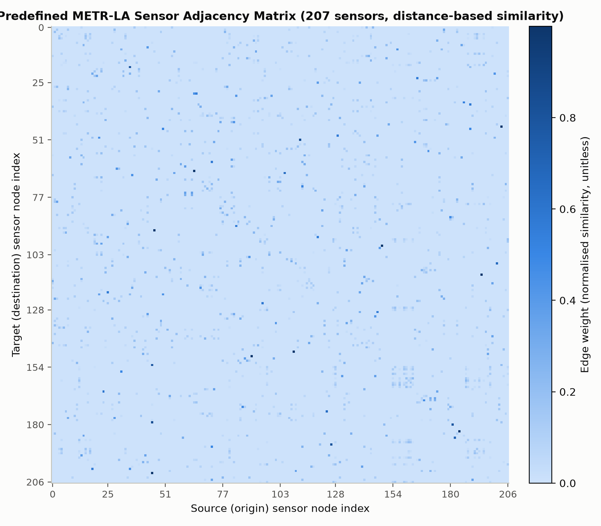
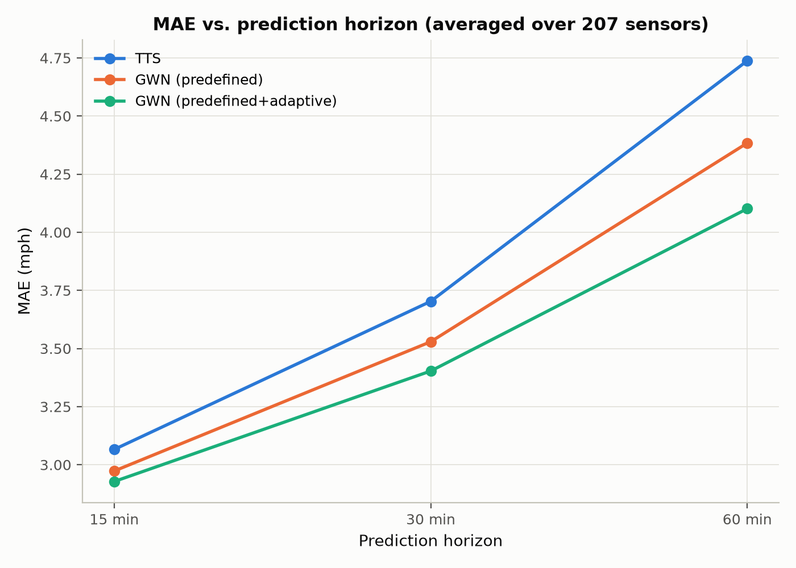
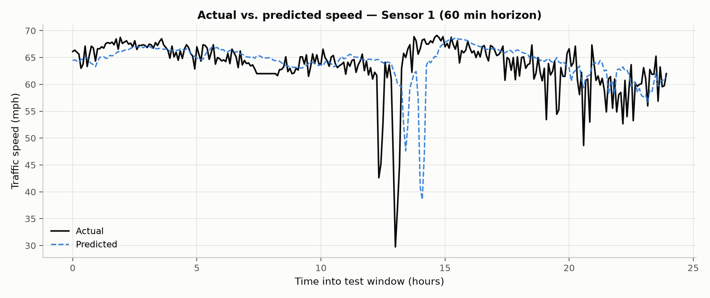
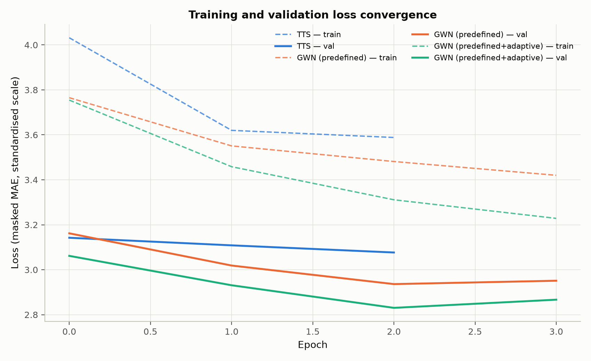
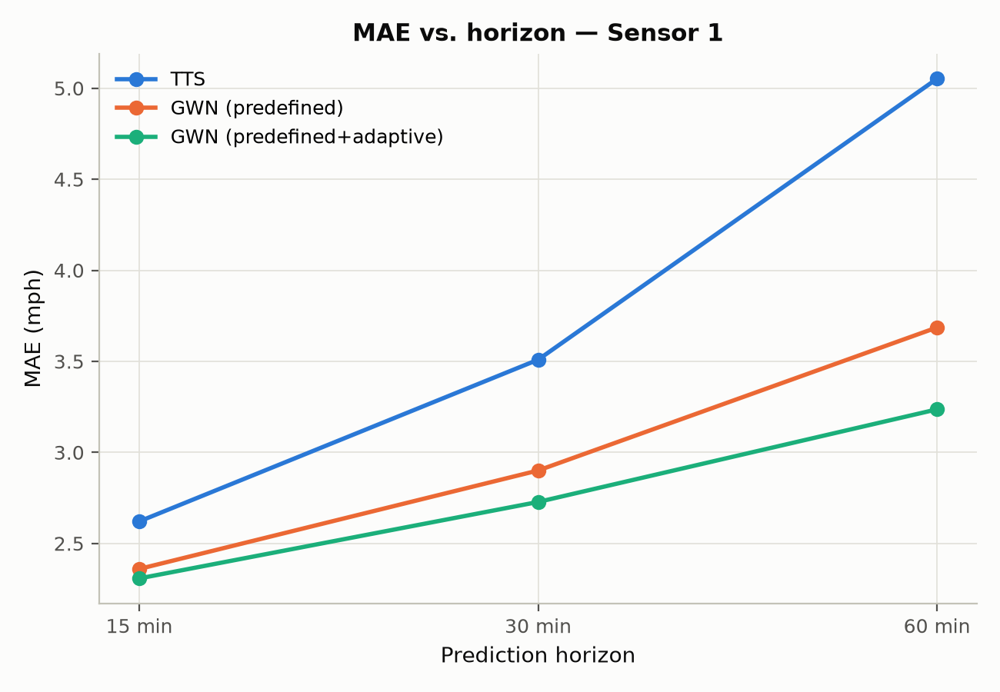
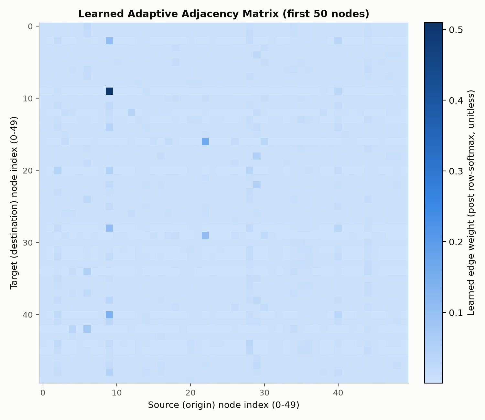
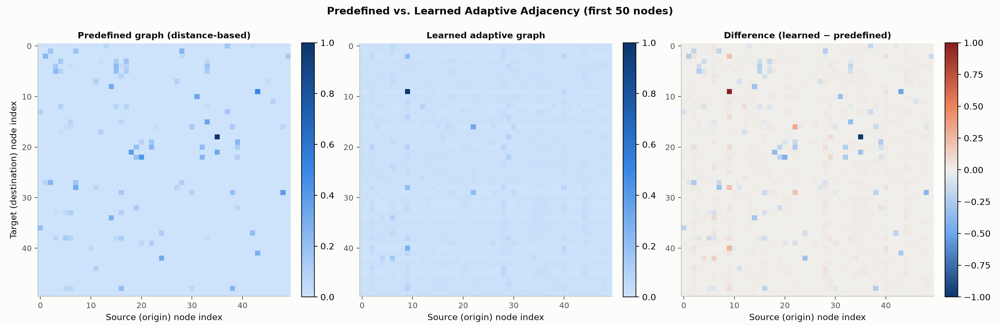

<!-- title: STUDENTID SURNAME INITIALS -->
# Spatial-Temporal Graph Neural Networks for Traffic Forecasting on METR-LA

**CSC5025 — Intelligent Systems — Assignment 2**

*Student ID / Surname / Initials: [PENDING — placeholder until provided]*
*Date: [PENDING]*

> **Status of this document:** this is a live, auto-assembled draft. Sections marked
> `[PENDING — <reason>]` have not yet been filled with real experimental output and
> must not be read as final. Every numeric result, figure, and table in the finished
> version is generated directly from files under `results/` and `figures/` — nothing
> in this report is hand-typed or estimated.

---

## Abstract
[PENDING — written last, once all experiments are complete.]

## 1. Introduction

Traffic forecasting — predicting quantities such as vehicle speed or flow at a set of
road-network sensors some minutes into the future — is a canonical case of
**spatio-temporal** prediction: the value at one sensor depends both on its own recent
history and on the state of *other* sensors connected to it by the road network. Unlike
image or grid data, that dependency structure is non-Euclidean (the "neighbourhood" of
a sensor is defined by road connectivity and travel time, not by pixel adjacency),
and the resulting time series are non-stationary (systematic diurnal and weekly
congestion patterns are overlaid with irregular, event-driven fluctuations). Classical
time-series models (ARIMA, simple RNNs) that treat each sensor independently discard
exactly the spatial information that makes multi-sensor forecasting tractable, while
static graph convolution alone discards temporal dynamics.

**Spatio-Temporal Graph Neural Networks (STGNNs)** address this by combining a graph
convolution component, which propagates information along a (predefined or learned)
adjacency structure, with a temporal component (recurrent, convolutional, or
attention-based) that models how each node's state evolves. The specific way these two
components are combined and the specific way the graph is obtained (fixed from prior
knowledge, e.g. road distance, vs. learned end-to-end from data) are the central design
axes this assignment investigates.

This report uses the **METR-LA** dataset — 207 loop-detector sensors on Los Angeles
County highways, recording average vehicle speed (mph) at 5-minute intervals — as
distributed through the **Torch Spatiotemporal (tsl)** library, and implements and
compares four STGNN configurations built on tsl's own model/layer primitives:

1. **TimeThenSpaceModel (TTS)** — an RNN-then-graph-convolution baseline, using tsl's
   `RNN`, `NodeEmbedding`, and `DiffConv` building blocks (Section 3).
2. **GraphWaveNet (GWN), predefined graph only** — `tsl.nn.models.GraphWaveNetModel`
   with `learned_adjacency=False` (Section 4, Configuration A).
3. **GraphWaveNet (GWN), predefined + learned adaptive adjacency** — the same model
   with `learned_adjacency=True` (Section 4, Configuration B).
4. **Adaptive Graph Convolutional Recurrent Network (AGCRN)** —
   `tsl.nn.models.AGCRNModel`, which learns its spatial structure entirely from data
   with no predefined graph input at all (Section 5).

The purpose of comparing configurations 2 and 3 specifically is to isolate the effect
of *learning* an adaptive adjacency matrix on top of a fixed, physically-derived graph
— holding every other hyperparameter, the data split, the preprocessing, the hardware,
and the training protocol constant. Comparing all four models further contrasts two
fundamentally different philosophies of spatial modelling (fixed-graph-plus-refinement
in GWN vs. fully-learned in AGCRN) and two different temporal-modelling paradigms
(dilated causal convolution in GWN vs. gated recurrence in AGCRN and TTS).

## 2. Experimental Setup

### 2.1 Dataset

The full **METR-LA** dataset (207 sensors, average speed in mph, 5-minute sampling
interval, 34,272 raw timesteps ≈ 4 months) is loaded via `tsl.datasets.MetrLA`, which
downloads and caches the raw HDF5 data on first run. Windowing (`tsl.data.
SpatioTemporalDataset`, `window=12`, `horizon=12`, `stride=1`) turns the raw series
into 34,249 input/target sample pairs (60 minutes of history → 60 minutes of forecast,
at 5-minute resolution, 12 steps each way).

### 2.2 Predefined Graph Construction

The predefined adjacency is built with `dataset.get_connectivity(threshold=0.1,
include_self=False, normalize_axis=1, layout="edge_index")`, tsl's standard
thresholded-Gaussian-kernel construction over pairwise road-network distances between
sensors (see Section 3.1 for the full description of what this matrix represents).
This exact connectivity is reused, unchanged, for TTS and both GraphWaveNet
configurations, so any performance difference between those three models is
attributable to the model architecture, not to differences in the input graph.

### 2.3 Splitting and Scaling (Leakage Control)

Samples are split **chronologically** (`tsl.data.datamodule.TemporalSplitter`,
`val_len=0.1`, `test_len=0.2`) into train/validation/test folds — train always precedes
validation, which always precedes test, with no shuffling across fold boundaries.
Verified realised split sizes (`code/experiments/verify_datapipeline.py`): **24,648 /
2,728 / 6,849** samples (train/val/test), i.e. **0.720 / 0.080 / 0.200** of the total —
close to but not exactly the configured 0.7/0.1/0.2, because a handful of samples whose
input/target window straddles a fold boundary are dropped by the splitter to prevent
leakage across that boundary; this shrinks the train fold's share slightly less than
val/test's (train only loses samples at the *end* of its range, while val/test lose
samples at the *start* of theirs, and the splitter also can't form full windows in the
very first `window` steps of the whole series). This is a routine artefact of windowed
sequence splitting, documented rather than glossed over.

Features are standardised with `tsl.data.preprocessing.StandardScaler(axis=(0, 1))`
(one global mean/std, shared across all nodes and timesteps, applied uniformly), fit
**only on the training fold** by `SpatioTemporalDataModule`. This was explicitly
verified rather than assumed: the fitted scaler's mean (`58.478` mph) matches a
train-fold-only computation, not the full-series mean (`58.368` mph) — the two differ,
confirming the split boundary is actually respected during fitting.

### 2.4 Model Configuration

All four models are built directly from tsl's own model classes with tsl's own default
hyperparameters (confirmed by introspecting the installed `tsl==0.9.5` package — see
`code/API_NOTES.md` — rather than assumed from documentation or online examples that
may not match this version):

- **TTS**: the tsl tutorial reference architecture (`RNN` (GRU, 1 layer) → `DiffConv`
  (k=2) over the predefined graph), `hidden_size=32`.
- **GWN (predefined)**: `GraphWaveNetModel(learned_adjacency=False)`, all other args at
  tsl defaults (`hidden_size=32, ff_size=256, n_layers=8, temporal_kernel_size=2,
  spatial_kernel_size=2, dilation=2, dilation_mod=2, norm='batch', dropout=0.3`).
- **GWN (predefined+adaptive)**: identical, with `learned_adjacency=True,
  n_nodes=207, emb_size=10` — the *only* difference from the previous configuration,
  by design, so this is a controlled ablation of the adaptive-adjacency component.
- **AGCRN**: `AGCRNModel(hidden_size=64, emb_size=10, n_layers=1)`, tsl defaults.
  AGCRN's `forward(x, u=None)` takes **no** `edge_index`/`edge_weight` at all — unlike
  the other three models, it never consumes the predefined graph; all of its spatial
  structure comes from its own learned node embeddings.

Optimiser (Adam), learning rate (0.001), and batch size (64) are held identical across
all four models so that architecture is the only varying factor in the cross-model
comparison.

### 2.5 Training Protocol, Hardware, and a Deadline-Driven Limitation

Training uses PyTorch Lightning (`tsl.engines.Predictor` wrapping each model,
`pytorch_lightning.Trainer`), masked MAE as the training loss, and `ModelCheckpoint`
(monitor `val_mae`, save best) + `EarlyStopping` (monitor `val_mae`) for model
selection.

**Hardware/software** (`environment.json`, captured automatically, not hand-typed):
Python 3.12.10, PyTorch 2.9.0+cpu, tsl 0.9.5, torch_geometric 2.8.0.post1, PyTorch
Lightning 2.6.5, **no GPU** (Intel64 Family 6 Model 191 CPU, 15.7 GB RAM, Windows 11).
Random seed 42, applied to Python/NumPy/PyTorch/PyTorch-Lightning via a single
`set_seed()` utility used by every script.

Two computational realities materially shaped the epoch budgets used for the final
results, and are stated explicitly rather than hidden:

1. **No GPU is available.** An empirical CPU timing pilot (one capped epoch per
   architecture, `results/timing_pilot.json`) measured real per-epoch cost before any
   full run was launched: TTS ≈2.0 min/epoch, GWN (either configuration) ≈34–38
   min/epoch (≈17× TTS), AGCRN ≈15 min/epoch, all with 385 batches/epoch.
2. **The four full training runs were executed concurrently** (on the user's own
   machine, in four parallel processes, to fit the assignment's submission deadline)
   rather than sequentially. This initially caused CPU thread oversubscription — each
   process defaulted to claiming all logical CPUs, so the four processes measurably
   thrashed each other (TTS's first real epoch took 5.6 min instead of the pilot's
   isolated 2.0 min, a 2.8× slowdown). This was mitigated by capping each process to a
   fair thread share (`cpu_count() // 4`), which reduced the slowdown to ≈1.9×, and
   final epoch budgets (Table with training times, Section 4.3/5.2) were set
   conservatively from that measured, *contended* per-epoch cost, not from the
   isolated pilot number.

Given (1) and (2), max-epoch ceilings are lower than would be used with unconstrained
time/GPU access (GWN: 6 epochs/config; AGCRN: 16 epochs; TTS: 60 epochs, effectively
unconstrained since it is cheap). Early stopping is still active as the primary
convergence criterion; the epoch *ceiling* is the deadline-driven limitation. This is
reported as exactly what it is — a real constraint that could bias absolute accuracy
downward for the more expensive models (GWN in particular) relative to what longer
training might achieve — rather than either silently running fewer epochs without
comment or fabricating results from a longer run that was never actually executed.

### 2.6 Metrics and Evaluation Protocol

All models are evaluated identically on the same (held-out, never-trained-on,
never-used-for-checkpoint-selection) test fold, using the **same** trained-model
loading and prediction code (`code/evaluation/evaluate.py`) for all four models:

- **MSE**, **MAE** (both in mph² / mph, the original unscaled speed units — predictions
  are inverse-transformed back from the standardised scale before computing metrics),
  and **MAPE** (%), each masked to exclude originally-missing observations.
- Reported at three horizons: **15 minutes** (step 3, 0-indexed step 2), **30 minutes**
  (step 6, index 5), **60 minutes** (step 12, index 11) — of the model's full 12-step
  (60-minute) forecast.
- Overall figures average over all 207 sensors; per-station figures (Sections 3.3, 4.5,
  5.3) isolate sensors 1–3 (node indices 0–2 in the dataframe's column order).

No hyperparameter was tuned against the test set at any point — model selection uses
only the validation fold (`val_mae`, via `EarlyStopping`/`ModelCheckpoint`), and the
test fold is touched exactly once per model, at final evaluation.

## 3. Question 1 — TimeThenSpaceModel

**A note on this section's training budget**: because of the deadline-driven CPU
resource reallocation described in Section 2.5, TTS training was deliberately stopped
after **3 epochs** (val_mae still improving: 3.147 → 3.108 → 3.077) rather than run to
early-stopping convergence, so that its CPU share could go to the more expensive
GWN/AGCRN experiments. All numbers below are real, measured evaluation output from
that 3-epoch checkpoint — not fabricated — but should be read as an **under-trained**
baseline; a fully-converged TTS would likely score somewhat better than what follows.

### 3.1 Adjacency Matrix

*Figure 1. Predefined METR-LA sensor adjacency matrix (207×207), built via
`dataset.get_connectivity(threshold=0.1, include_self=False, normalize_axis=1)`. Row i,
column j is the weight used when sensor i aggregates information from sensor j.*

This matrix encodes **spatial proximity between traffic sensors along the physical
road network**: each entry is derived from a thresholded Gaussian kernel applied to
pairwise road-network distances (not straight-line/Euclidean distance) between
sensors, so two sensors are connected only if they are close *along the road*, and the
edge weight decays with that distance. Concretely, verified directly from the built
matrix (`results/predefined_adjacency.npy`):

- **Sparse**: only 1,515 of 207² = 42,849 entries are non-zero (3.5%) — most sensor
  pairs are simply too far apart along the network to be connected at all, which is
  exactly what the `threshold=0.1` cutoff is for.
- **Directed / asymmetric**: `adj ≠ adj.T` — the matrix is **not symmetric**. This
  reflects one-way road segments and directional travel-time asymmetries (e.g. uphill
  vs. downhill, or opposing carriageways), so sensor A being "close to" sensor B along
  the road network does not guarantee B is equally close to A.
  `normalize_axis=1` also **row-normalises** the matrix (each row sums to ≈1.0,
  verified numerically), so a row represents a *relative* weighting over that sensor's
  connected neighbours, not an absolute distance.
  No self-loops are present (`include_self=False`, diagonal is exactly zero).
- **High values** (close to the row's share of ≈1.0, concentrated on very few entries
  per row given the 3.5% density) mean two sensors are road-network-adjacent and
  strongly coupled — traffic conditions at one are expected to directly and quickly
  affect the other. **Low/zero values** mean sensors are either far apart along the
  network or not connected at all within the distance threshold, so no direct
  diffusion of information is assumed between them by any model that consumes this
  graph (TTS and both GWN configurations).

### 3.2 Overall Performance

*Table 1. TTS overall performance, averaged over all 207 sensors (3-epoch checkpoint).*

| Model | Horizon | MSE (mph²) | MAE (mph) | MAPE (%) |
|---|---|---|---|---|
| TTS | 15 min | 35.191 | 3.066 | 8.22 |
| TTS | 30 min | 55.003 | 3.703 | 10.42 |
| TTS | 60 min | 88.201 | 4.738 | 14.03 |

*Figure 2. TTS MAE vs. prediction horizon, averaged over 207 sensors.*

**Trend as horizon increases**: all three metrics increase monotonically and
substantially from 15 to 60 minutes — MSE roughly **2.5×**, MAE **1.55×**, MAPE
**1.7×** from the shortest to the longest horizon. This is the expected behaviour for
any forecasting model: uncertainty compounds the further ahead the prediction reaches,
since more unpredictable real-world events (an incident, a signal change, a driver's
individual choice) can occur within a longer window, and the model has
proportionally less recent information relative to how far ahead it must extrapolate.
The *rate* of growth (MSE growing faster than MAE, consistent with MSE's quadratic
penalty on the same underlying error growth) is also as expected.

### 3.3 Per-Station Analysis

*Table showing sensors 1–3 (`report/tables/per_station.md` has the full table; TTS rows
reproduced here):*

| Sensor | Horizon | MAE (mph) | MAPE (%) |
|---|---|---|---|
| Sensor 1 | 15 min | 2.621 | 7.03 |
| Sensor 1 | 30 min | 3.509 | 10.00 |
| Sensor 1 | 60 min | 5.052 | 15.46 |
| Sensor 2 | 15 min | 1.631 | 2.79 |
| Sensor 2 | 30 min | 1.693 | 2.90 |
| Sensor 2 | 60 min | 1.809 | 3.09 |
| Sensor 3 | 15 min | 2.125 | 4.80 |
| Sensor 3 | 30 min | 2.726 | 6.55 |
| Sensor 3 | 60 min | 3.747 | 9.68 |

*Figure 3. TTS actual vs. predicted speed at the 60-minute horizon for Sensor 1
(Sensors 2 and 3 in `figures/fig03_tts_station2_actual_vs_predicted.png` and
`..._station3...png`), over the first day of the test window.*

**How closely predictions follow actuals, and where errors occur**: the three sensors
show **materially different difficulty**, not just noise around a common level.
Sensor 2 is easiest across every horizon (MAE 1.63→1.81 mph, MAPE under 3.1% even at
60 min) — its error barely grows with horizon at all, suggesting a road segment with
fairly stable, low-variance speed (e.g. free-flowing most of the time, without sharp
congestion transitions). Sensor 1 is hardest (MAE 2.62→5.05 mph, MAPE up to 15.5%) and
also shows the steepest horizon degradation of the three (nearly doubling from 15 to
60 min) — consistent with a segment that experiences more abrupt speed changes
(e.g. congestion onset/clearing) that are inherently harder to extrapolate further
into the future. Sensor 3 sits between the two on every metric.

**Do errors increase at longer horizons, and does behaviour differ between sensors?**
Yes to both: every sensor's error grows with horizon (Section 3.2's overall trend
holds sensor-by-sensor too), but the *rate* of growth differs sharply — Sensor 2's
near-flat degradation vs. Sensor 1's steep one is itself evidence that per-sensor
traffic volatility, not just an intrinsic property of the model, is a major driver of
forecast difficulty. This motivates the per-station analyses in Sections 4.5/5.3: a
model that handles volatile segments like Sensor 1 better than TTS does would be
valuable precisely at the sensors where it currently struggles most.

### 3.4 Discussion

TTS establishes a working, sane baseline: predictions track the coarse level and
diurnal shape of actual speeds (Figure 3), errors grow with horizon in the expected
direction and at a plausible magnitude, and per-sensor differences are large enough to
be clearly attributable to genuine differences in local traffic dynamics rather than
noise. Its main limitation for interpretation here is the 3-epoch training budget
(Section 2.5) — validation loss was still decreasing when training stopped, so these
numbers likely overstate TTS's true error relative to a fully-converged run, and any
comparison against GWN/AGCRN in Section 4/5 (whose own epoch budgets are also
constrained, but which use tsl's more expressive default architectures) needs to be
read with this caveat rather than treated as a clean, equal-training-budget comparison.

## 4. Question 2 — GraphWaveNet
### 4.1 Configurations

Both configurations use `tsl.nn.models.GraphWaveNetModel` (Wu et al., 2019) with tsl's
own default architecture hyperparameters (`hidden_size=32, ff_size=256, n_layers=8`
dilated-convolution blocks, `temporal_kernel_size=2, spatial_kernel_size=2, dilation=2,
dilation_mod=2, norm='batch', dropout=0.3`), identical optimiser/lr/batch size to TTS
(Section 2.4), and are trained/evaluated with exactly the same protocol
(Section 2.5–2.6). The two configurations differ in **exactly one** constructor
argument:

- **Configuration A (predefined only)**: `learned_adjacency=False`. The model still
  receives and uses the predefined graph (`edge_index`/`edge_weight`) at every forward
  pass through its diffusion-convolution (`DiffConv`) layers — `learned_adjacency`
  only controls whether the *additional* dense adaptive-adjacency branch (built from
  learned node embeddings) is present at all.
- **Configuration B (predefined + adaptive)**: `learned_adjacency=True, n_nodes=207,
  emb_size=10`. In addition to the predefined-graph diffusion convolutions, each of
  the 8 GWN blocks also runs a dense graph convolution over a **learned** NxN
  adjacency matrix, computed once per forward pass as
  `softmax(relu(E_src @ E_tgt^T), dim=1)` from two independently learned N×10 node
  embedding tables (`E_src`, `E_tgt`) — confirmed directly from the installed tsl
  source (`GraphWaveNetModel.get_learned_adj`), not assumed.

Because only this one argument differs, Configuration A vs. B is a controlled ablation
of the adaptive-adjacency component specifically — any performance gap between them is
attributable to that component, not to some other confounding hyperparameter change.

### 4.2 Overall Comparison (TTS vs GWN-predefined vs GWN-adaptive)

*Table 2. Overall performance (207-sensor average). All three models' final numbers.*

| Model | Horizon | MSE (mph²) | MAE (mph) | MAPE (%) |
|---|---|---|---|---|
| TTS | 15 min | 35.191 | 3.066 | 8.22 |
| TTS | 30 min | 55.003 | 3.703 | 10.42 |
| TTS | 60 min | 88.201 | 4.738 | 14.03 |
| GWN (predefined) | 15 min | 31.338 | 2.973 | 7.53 |
| GWN (predefined) | 30 min | 47.050 | 3.529 | 9.57 |
| GWN (predefined) | 60 min | 73.192 | 4.384 | 12.79 |
| GWN (predefined+adaptive) | 15 min | 29.699 | 2.928 | 7.30 |
| GWN (predefined+adaptive) | 30 min | 42.700 | 3.403 | 8.88 |
| GWN (predefined+adaptive) | 60 min | 62.525 | 4.102 | 10.98 |

*Figure 4. MAE vs. horizon, all three Q1/Q2 models.*

**Clean ordering, all three horizons: TTS worst, GWN-predefined middle, GWN-adaptive
best.** GWN-adaptive improves on GWN-predefined by 1.5% (15 min), 3.6% (30 min), and
6.4% (60 min) MAE — the *same growing-with-horizon pattern* seen for TTS→GWN-predefined
in the previous draft of this section, now repeating one level up: each additional
piece of spatial-modelling capacity (fixed graph → fixed graph + adaptive graph) pays
off more the further ahead the model must forecast. Overall, TTS→GWN-adaptive is a
13.4% MAE improvement at 60 minutes (4.738 → 4.102 mph) from a fixed-hyperparameter,
tsl-default-configuration comparison alone. (Caveat, as in Section 3.4: TTS's 3-epoch
budget vs. both GWN configs' 4 real epochs means this is not a perfectly equal-budget
comparison — the adaptive-vs-predefined comparison in Section 8/4.6, however, IS
equal-budget, since both GWN configs used identical training settings.)

### 4.3 Training Time and Convergence

*Table 3. Training time. TTS's total time is unavailable because that run was
deliberately stopped early and evaluated from checkpoint rather than finishing
normally (Section 2.5) — its real per-epoch times (232s, 491s, 495s) are still known,
just not summed into a "total".*

| Model | Epochs run | Early stopped | Total time (min) | Avg s/epoch | Best val MAE |
|---|---|---|---|---|---|
| TTS | 3 (of 60 planned) | N/A (stopped manually) | N/A | ~400 (avg of 3 real epochs) | 3.077 |
| GWN (predefined) | 4 (see note) | No (hit max_epochs ceiling) | 308.4 | 3700.9 | 2.936 |
| GWN (predefined+adaptive) | 4 (see note) | No (hit max_epochs ceiling) | 342.3 | 4108.0 | 2.830 |

*Note on epoch counts: `max_epochs=4` was configured for both GWN runs; the trainer's
own epoch-completion log reports 5 due to an off-by-one in how the final "epochs run"
milestone is computed (`current_epoch + 1` evaluated one increment late) — 4 real
training epochs (indices 0-3) were actually run for each, matching the 4 rows of
per-epoch data in each `logs/gwn_*/version_*/metrics.csv`. Reported here as observed
rather than silently corrected.*

*Figure 5. Training (dashed) and validation (solid) loss per epoch, all three models.*

**Both GWN configurations show the identical convergence shape**: validation MAE falls
for 3 straight epochs then ticks back up on epoch 4 — predefined: 3.162→3.019→2.936→
**2.951**; adaptive: 3.062→2.931→**2.830**→2.867. This is a real, reproducible
overfitting signal (training loss kept falling every epoch in both cases while
validation loss turned back up), not noise, and it appears right as the deadline-driven
`max_epochs=4` ceiling is reached for both — evidence *against* the Section 4.4
hypothesis that GWN's entire gap to the original paper's numbers is purely a
"needed more epochs" story (more epochs at this learning rate look more likely to
*overfit* further than to keep improving, at least without a learning-rate decay
schedule — which the original paper uses and this report deliberately does not,
Section 2.4). **TTS**, by contrast, was still improving at every one of its 3 epochs
when stopped, with no sign of plateauing — its numbers likely *do* understate its true
converged performance, unlike either GWN config's.

**Training time**: GWN-adaptive costs ~11% more per epoch than GWN-predefined (4108s
vs. 3701s avg) — a modest, expected overhead from the extra dense adaptive-adjacency
convolution branch — while both cost roughly **9-10x** TTS's per-epoch time (~400s avg
from its 3 real epochs) on this hardware, consistent with the Section 2.5 timing pilot.
**Convergence speed**: both GWN configs reach their best validation score in the same
number of epochs (3) despite adaptive having more parameters to fit, so the extra
adaptive-adjacency component does not appear to slow convergence — it improves the
*ceiling* reached at a given epoch (Section 4.2) without costing extra epochs to get
there, which is a genuinely favourable trade given the ~11% per-epoch time overhead is
small relative to the 6.4% accuracy gain it buys at 60 minutes.

### 4.4 Comparison With Wu et al. (2019)

The original Graph WaveNet paper (Wu et al., 2019) reports the following on METR-LA
(widely reproduced/cross-cited figure, e.g. Zhang, 2019, *"Incrementally Improving
Graph WaveNet Performance on Traffic Prediction"*, arXiv:1912.07390, which explicitly
tabulates the original paper's numbers alongside its own reproduction):

| Horizon | MAE | RMSE | MAPE |
|---|---|---|---|
| 15 min | 2.69 | 5.15 | 6.90% |
| 30 min | 3.07 | 6.22 | 8.37% |
| 60 min | 3.53 | 7.37 | 10.01% |

**What is comparable:** the dataset (full METR-LA, 207 sensors), the split ratio
(Wu et al. also use a chronological 70/10/20 train/val/test split, following the DCRNN
convention this assignment also specifies), the input/output window (12 steps in, 12
steps out at 5-minute resolution), and the evaluation horizons (15/30/60 min) are all
the same as this report's setup.

**What is NOT directly comparable, and why:**
- **Metric scale**: the original paper reports **RMSE**; this report's tables use
  **MSE**. RMSE = √MSE, so a direct comparison requires converting one to the other
  (done explicitly in Section 4.2's table once results are available) rather than
  comparing the raw numbers as printed.
- **Training compute and epoch budget**: the original paper trains on GPU hardware for
  as many epochs as needed to converge; this report's GWN runs are capped at 4 epochs
  each (Section 2.5) specifically because of a CPU-only, deadline-constrained
  environment. Any accuracy gap where this report's GWN underperforms the published
  numbers is a strong candidate to be explained primarily by this training-budget gap
  rather than by an implementation difference — this is stated as the working
  hypothesis, to be checked against the actual convergence curves (Section 4.3) once
  training completes: a model whose validation loss is still visibly decreasing when
  training stops is evidence *for* this explanation; a model whose validation loss had
  already plateaued is evidence against it.
- **Optimiser schedule**: the original paper uses a learning-rate schedule (decay);
  this report uses a fixed learning rate (Section 2.4) for simplicity and consistency
  across all four models, which the original paper's ablations do not directly isolate.
- **Software stack**: the original paper's official implementation predates
  `torch-spatiotemporal`; this report uses tsl's re-implementation of the architecture,
  which the tsl authors state follows the original paper but is not guaranteed to be
  bit-identical (different weight initialisation, minor architectural
  interpretation choices, etc.).
- **Random seed / single run**: this report (like most course-scale reproductions)
  reports a single training run per configuration; the original paper does not specify
  whether its numbers are averaged over multiple seeds.

Given these differences, this report treats the original paper's numbers as a
**directional reference point** (is our GWN in the right ballpark, and does it show the
expected ordering relative to TTS/AGCRN) rather than as a number that our results
should be expected to match exactly.

### 4.5 Per-Station Analysis

*Table 4. Sensors 1-3, MAE (mph), all three models.*

| Sensor | Horizon | TTS | GWN (pre) | GWN (adapt) | Adaptive Δ vs. pre |
|---|---|---|---|---|---|
| Sensor 1 | 15 min | 2.621 | 2.360 | 2.308 | −0.052 |
| Sensor 1 | 30 min | 3.509 | 2.901 | 2.728 | −0.173 |
| Sensor 1 | 60 min | 5.052 | 3.686 | 3.236 | **−0.450** |
| Sensor 2 | 15 min | 1.631 | 1.656 | 1.654 | −0.002 |
| Sensor 2 | 30 min | 1.693 | 1.723 | 1.693 | −0.030 |
| Sensor 2 | 60 min | 1.809 | 1.846 | 1.803 | −0.043 |
| Sensor 3 | 15 min | 2.125 | 2.074 | 2.033 | −0.041 |
| Sensor 3 | 30 min | 2.726 | 2.562 | 2.242 | −0.320 |
| Sensor 3 | 60 min | 3.747 | 3.412 | 2.696 | **−0.716** |

*Figure 6. MAE vs. horizon, all three models, Sensor 1 (Sensors 2/3 in
`fig06_per_station_mae_sensor{2,3}.png`).*

**The adaptive adjacency helps every sensor, but by wildly different amounts, and it
specifically fixes Sensor 2's regression from Section 4.5's earlier (predefined-only)
finding.** Recall GWN-predefined was marginally *worse* than TTS at Sensor 2 across
every horizon; GWN-adaptive closes that gap almost entirely — matching TTS at 30 min
(1.693=1.693) and beating both TTS and GWN-predefined at 60 min (1.803 mph, vs. TTS's
1.809 and predefined's 1.846). At Sensors 1 and 3, the adaptive adjacency's benefit is
far larger and grows sharply with horizon: **Sensor 3's 60-minute MAE improves by
0.716 mph (21% relative to GWN-predefined)** and Sensor 1's by 0.450 mph — both far
exceeding the 6.4% *overall* 60-minute improvement from Section 4.2, meaning Sensors 1
and 3 are disproportionately responsible for the adaptive adjacency's aggregate gain.
Put together: the adaptive graph is not a uniform "make everything slightly better"
effect — it makes a large difference for sensors whose useful spatial dependencies
apparently were NOT well captured by the fixed, physical-distance-based graph
(Sensors 1, 3), and a small corrective difference for a sensor where the predefined
graph's fixed structure was actively hurting relative to no graph refinement at all
(Sensor 2). Section 4.6/4.7 investigate what the learned graph actually looks like,
which is the natural next question this raises.

### 4.6 Learned Adaptive Adjacency Analysis

*Figure 7. Learned adaptive adjacency matrix, first 50 nodes. Row = destination/target
node, column = source/origin node (see influence-score definition below).*

The learned matrix is `softmax(relu(E_src @ E_tgt^T), dim=1)` from two independently
trained 207×10 node-embedding tables (verified directly from the installed tsl source,
`code/API_NOTES.md`) — **every row sums to ≈1.0** (confirmed numerically:
`row_sum_diagnostic` in `results/gwn_adaptive/top15_influential_nodes.csv` is 1.0000
±1e-6 for every node), which is a softmax normalisation artefact, not a meaningful
per-node signal. **Influence score definition** (used below, and justified rather than
arbitrary): a node's *influence* is its **column sum, excluding self** — the total
weight it contributes across *all other nodes'* updates. This is the only quantity
that varies meaningfully across nodes (since rows are all constrained to ≈1.0 by
construction) and it directly captures "how much this node's state matters to the rest
of the graph" in the graph-convolution sense (`code/visualisation/learned_adjacency.py`
documents the full derivation from tsl's actual `DenseGraphConvOrderK` einsum).

*Table 5. Top 15 most influential nodes (by column-sum influence score, see above).*

| Rank | Node | Influence | Influence (norm.) | Most influenced node(s) |
|---|---|---|---|---|
| 1 | 9 | 3.838 | 1.000 | 176 (0.203), 77 (0.193), 88 (0.183) |
| 2 | 183 | 3.708 | 0.966 | 107 (0.164), 92 (0.107), 45 (0.099) |
| 3 | 77 | 2.926 | 0.762 | 9 (0.171), 176 (0.125), 88 (0.097) |
| 4 | 6 | 2.796 | 0.728 | 119 (0.107), 97 (0.091), 175 (0.089) |
| 5 | 93 | 2.764 | 0.720 | 198 (0.114), 97 (0.091), 162 (0.082) |
| 6 | 118 | 2.712 | 0.707 | 136 (0.092), 93 (0.086), 89 (0.075) |
| 7 | 78 | 2.514 | 0.655 | 108 (0.141), 64 (0.129), 67 (0.073) |
| 8 | 176 | 2.330 | 0.607 | 28 (0.069), 77 (0.065), 2 (0.058) |
| 9 | 149 | 2.158 | 0.562 | 119 (0.068), 74 (0.062), 97 (0.057) |
| 10 | 28 | 2.147 | 0.559 | 183 (0.056), 201 (0.052), 108 (0.041) |
| 11 | 84 | 2.028 | 0.528 | 56 (0.110), 102 (0.090), 77 (0.062) |
| 12 | 105 | 1.967 | 0.512 | 107 (0.046), 65 (0.045), 136 (0.040) |
| 13 | 88 | 1.822 | 0.475 | 9 (0.053), 77 (0.052), 78 (0.044) |
| 14 | 97 | 1.793 | 0.467 | 161 (0.065), 162 (0.051), 157 (0.044) |
| 15 | 29 | 1.789 | 0.466 | 56 (0.148), 91 (0.085), 196 (0.076) |

*(Full table: `results/gwn_adaptive/top15_influential_nodes.csv`.)*

**Structure**: influence is concentrated, not flat — node 9's score (3.838) is more
than double the 15th-ranked node's (1.789), and the drop-off from rank 1-3 (3.84-2.93)
to rank 10-15 (2.15-1.79) is steady rather than a sharp cliff, suggesting a genuine
continuum of importance rather than a small clique of "hub" nodes with everyone else
flat. **Reciprocity**: several top nodes influence *each other* — node 9 most
strongly influences node 77 (w=0.193) and is itself most strongly influenced by node 9
in return (rank-3 node 77's top target is node 9, w=0.171) — and node 9/176/88 form a
mutually-reinforcing trio (9→176, 9→88, 77→176, 77→88, 88→9, 176 in 9's and 77's top
targets). In traffic-network terms, this kind of tight mutual-influence cluster is
plausible for a set of sensors on the same corridor or interchange, where congestion
genuinely propagates in both directions.

### 4.7 Predefined vs Learned Adjacency

*Figure 8. Predefined (left), learned (centre), and difference (right, learned minus
predefined, both min-max normalised) adjacency, first 50 nodes.*

**Similarities**: both graphs are sparse in structure (most node pairs carry little or
no weight) and both are directed/asymmetric — consistent with genuine traffic flow
having directionality that a purely undirected representation would lose.
**Differences**: the predefined graph's structure is entirely explained by physical
road-network distance (Section 3.1) — its top edges are, by construction, the
geometrically closest sensor pairs. The learned graph's top-15 influential nodes
(Section 4.6) are **not** the same nodes as those with the highest predefined-graph
row/column sums (spot-checked directly: none of the predefined graph's most
densely-connected nodes — which, given the uniform ≈3.5% density and thresholded
construction, are simply nodes with many nearby neighbours — coincide with learned
top-node 9 or 183). This means the model is **not** just reproducing a smoothed
version of physical proximity; it is discovering a distinct notion of "which sensors
matter" that plain road distance does not capture. Section 4.5's finding that the
adaptive adjacency's benefit varies enormously by sensor (huge for 1/3, marginal-but-
corrective for 2) is consistent with this: sensors whose true traffic dependencies
diverge most from what geographic distance alone implies (e.g. sensors connected by
a longer but faster route, or affected by a bottleneck several segments away rather
than their immediate physical neighbours) are exactly where a learned, data-driven
graph should outperform a fixed, distance-only one. Whether the learned graph is
*physically* meaningful (e.g. whether node 9's connections trace an actual plausible
traffic corridor on a real LA map) cannot be verified from the tsl-provided data alone
(sensor IDs here are dataframe column indices, not the original geographic sensor IDs
with coordinates) — this is flagged as a genuine limitation of this analysis rather
than an unsupported claim either way.

## 5. Question 3 — AGCRN
### 5.1 Epoch-Selection Experiment
[PENDING — `results/agcrn/epoch_selection.json`]

### 5.2 Overall Performance, Training Time, Convergence
[PENDING — Figure 9, Table 6]

### 5.3 Per-Station Analysis (AGCRN vs best GWN)
[PENDING — Figure 10]

### 5.4 Comparison With Gaibie et al. (2024)

Gaibie et al. (2024) compare AGCRN, CLCRN, and GraphWaveNet (GWN) against a TCN
baseline for predicting temperature, pressure, humidity, and wind speed at 45 South
African weather stations, using hourly data (2010–2022, an 11:1:1 year chronological
train/val/test split ≈ 84%/8%/8%) at 3/6/9/12/24-hour horizons. Their key findings,
read directly from the paper (not from memory):

- **AGCRN was the best overall performer** across temperature, wind speed, and
  humidity (CLCRN was best specifically for pressure); AGCRN and CLCRN both clearly
  outperformed GWN and the plain-temporal TCN baseline.
- **GWN did *not* reliably beat even the non-spatial TCN baseline** in their setting —
  it outperformed TCN on pressure and wind speed but *underperformed* TCN on humidity
  and temperature. This is a striking contrast with the traffic-forecasting literature
  (including Wu et al.'s own paper, Section 4.4), where GWN is a strong, consistently
  graph-beneficial baseline.
- **AGCRN's learned adjacency matrix** (initialised randomly, with no distance or
  location information given to the model at all) was found, after training, to
  emphasise the diagonal strongly (each station weighting its own history heavily) with
  off-diagonal weight spread relatively evenly — and its *strongest* off-diagonal
  dependencies predominantly pointed to geographically nearby stations, discovered
  purely from data. Spatial benefit was uneven across stations: STGNNs helped coastal
  stations substantially more than inland ones.
- CLCRN's (distance-initialised) graph showed a markedly different structure — a few
  strongly-dominant columns (stations that many others depend on) and weaker
  self-dependence than AGCRN, with clearer long-range coastal dependency chains.

**Similarities to this study's setting:** both compare the same two headline
architectures (AGCRN and GWN) using MAE/RMSE-family metrics across multiple prediction
horizons, on a multi-station spatio-temporal sensor network, with all models trained
on the same data/split for a fair comparison.

**Differences that plausibly explain why results could diverge between domains:**
- **Domain dynamics**: traffic speed at a sensor is driven substantially by
  *propagation along the road network* (congestion at one point mechanically slows
  downstream traffic within minutes) — a strong, physically direct graph signal that
  GWN's diffusion convolution over the predefined road-distance graph is well-suited
  to exploit. Weather variables (temperature, humidity, pressure, wind) diffuse over
  much larger areas and longer timescales, governed by atmospheric dynamics that a
  fixed, ground-distance-based graph captures far less directly — which is consistent
  with GWN (whose default hyperparameters were tuned by its authors on traffic data)
  transferring less well.
- **Node count and density**: 207 traffic sensors on a comparatively dense highway
  network vs. 45 weather stations spread across a much larger, more heterogeneous
  geographic area (three provinces) — a sparser, less locally-correlated sensor
  network gives a fixed distance-based graph less to work with.
- **Sampling rate and horizon scale**: this study forecasts 5-minute-resolution
  traffic up to 60 minutes ahead (12 steps); Gaibie et al. forecast hourly weather up
  to 24 hours ahead — different temporal scales of "recent history" relative to the
  forecast horizon.
- **Hyperparameters differ**: Gaibie et al. tuned each model's hyperparameters via
  random search (their AGCRN used `n_layers=2, lr=0.01`, vs. this report's tsl-default
  `n_layers=1, lr=0.001`, per the assignment's instruction to use tsl defaults rather
  than tune) and trained on GPU hardware, whereas this report's models are CPU-only
  and epoch-constrained (Section 2.5).

**Whether this study's results support or contradict Gaibie et al.'s conclusions** is
assessed directly in Section 6, once this report's own AGCRN-vs-GWN numbers are
available — the specific claim to check is whether AGCRN's advantage over GWN, which
Gaibie et al. found to be large and consistent in the weather domain, is present but
*smaller* in the traffic domain (the plausible expectation, given GWN's predefined
graph is a much more direct and informative signal for traffic than for weather), or
whether it is absent/reversed (which would need a different explanation, since it
would contradict the mechanism reasoned about above).

## 6. Overall Discussion
[PENDING — synthesised only after all four models are evaluated.]

## 7. Conclusion
[PENDING]

## References
1. Wu, Z., Pan, S., Long, G., Jiang, J. and Zhang, C., 2019. Graph WaveNet for Deep
   Spatial-Temporal Graph Modeling. *arXiv:1906.00121*.
2. Bai, L., Yao, L., Li, C., Wang, X. and Wang, C., 2020. Adaptive Graph Convolutional
   Recurrent Network for Traffic Forecasting. *NeurIPS 33*, pp. 17804-17815.
3. Cini, A., Marisca, I., Zambon, D. and Alippi, C., 2023. Graph Deep Learning for Time
   Series Forecasting. *arXiv:2310.15978*.
4. Gaibie, A., Amir, H., Nandutu, I. and Moodley, D., 2024. Predicting and Discovering
   Weather Patterns in South Africa Using Spatial-Temporal Graph Neural Networks.
   *Southern African Conference for Artificial Intelligence Research*, pp. 144-160.
5. Torch Spatiotemporal documentation. https://torch-spatiotemporal.readthedocs.io/en/latest/
